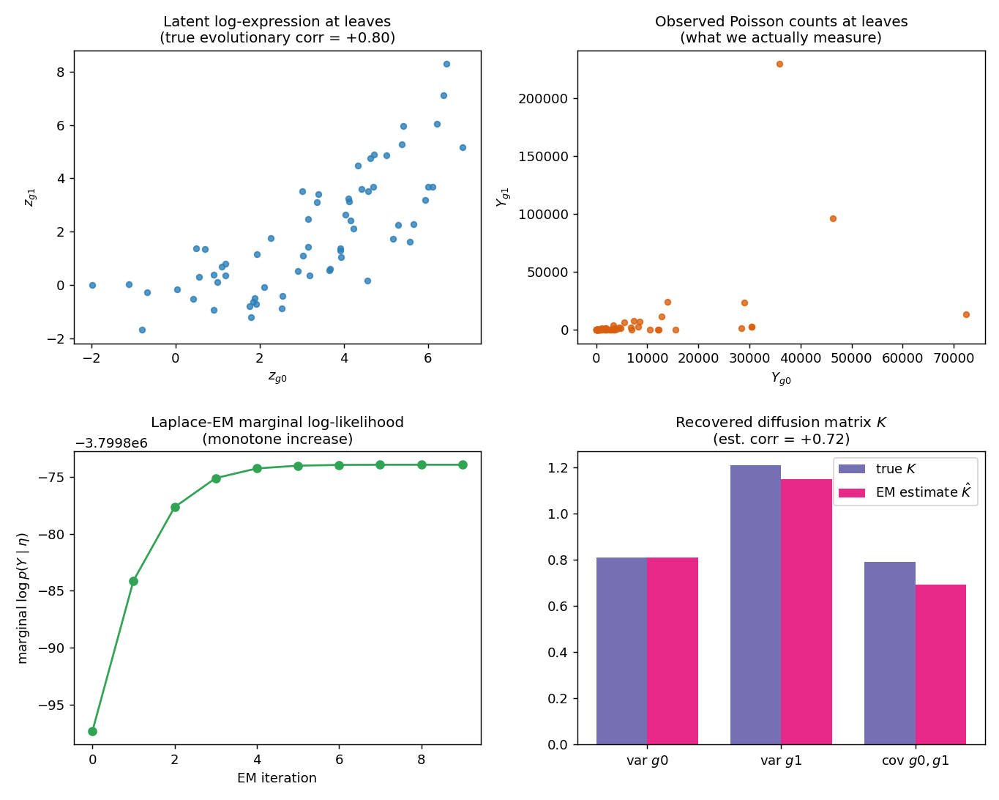
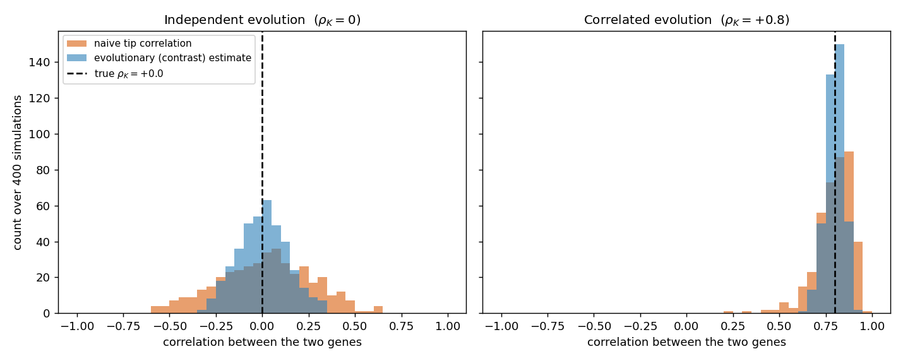
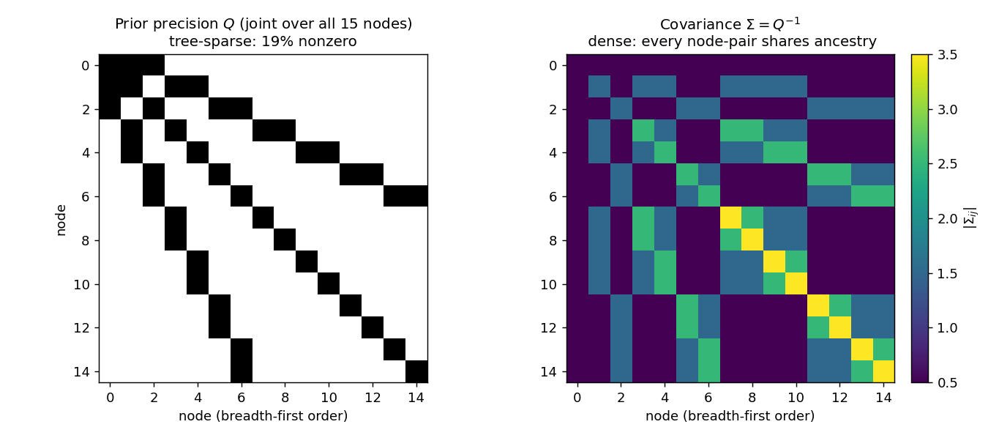

# Estimating Latent Evolutionary Models from Single-Cell Phylogenies

*A pedagogical, self-contained account of the statistical model, the algorithms, and the code in `scPhyTr`.*

---

> **How to read this document.** We begin with the scientific goal stated as a precise estimation problem, then build — piece by piece — the machinery needed to solve it at single-cell scale. A single simulated example is carried through the whole text so that every abstract quantity has a concrete referent. Sections are ordered the way one would actually derive the method, not the way the code happens to be filed; a [software map](#11-software-map) at the end links each idea to its implementation.

## Table of contents

1. [The estimation problem](#1-the-estimation-problem)
2. [The latent evolutionary model (the prior)](#2-the-latent-evolutionary-model-the-prior)
3. [The observation model (the likelihood), and why it is kept separate](#3-the-observation-model-the-likelihood-and-why-it-is-kept-separate)
4. [The joint law is a Gaussian Markov random field: why the precision is sparse](#4-the-joint-law-is-a-gaussian-markov-random-field-why-the-precision-is-sparse)
5. [Linear-time likelihoods: message passing, Felsenstein's pruning, and "contrasts"](#5-linear-time-likelihoods-message-passing-felsensteins-pruning-and-contrasts)
6. [Non-conjugate observations: a sparsity-preserving Laplace approximation](#6-non-conjugate-observations-a-sparsity-preserving-laplace-approximation)
7. [Correlated genes: the multivariate latent tree, `O(np^3)`](#7-correlated-genes-the-multivariate-latent-tree-onp3)
8. [Estimating the parameters](#8-estimating-the-parameters)
9. [Model selection: drift, selection, heritability ($`\lambda`$), and rate shifts](#9-model-selection-distinguishing-drift-from-selection)
10. [Related work: PATH, EvoGeneX/CAGEE, RevBayes, LORACs, TreeVAE, SCOUT, VOUS](#10-related-work-path-evogenexcagee-revbayes-loracs-treevae-scout-vous)
11. [Software map](#11-software-map)
12. [Validation strategy](#12-validation-strategy)
13. [Extensions and open directions](#13-extensions-and-open-directions)
14. [References](#14-references)

---

## 1. The estimation problem

### 1.1 What we are given, and what we want

Modern lineage-tracing assays (CRISPR/Cas9 recorders, mitochondrial variants, copy-number phylogenies) return two things measured on the *same* single cells:

1. a **phylogeny** $`T`$ — a rooted tree whose leaves are the sequenced cells (or clones) and whose branch lengths $`t_u`$ encode elapsed evolutionary/developmental time; and
2. **expression data** $`Y`$ at the leaves — most natively **counts** $`Y_{ig}`$ for cell $`i`$ and gene $`g`$.

We posit that the quantity that actually *evolves* is a latent, real-valued character $`z_u \in \mathbb{R}^p`$ at every node $`u`$ of the tree — think of $`z_{ig}`$ as the log-expression of gene $`g`$ in cell $`i`$ — and that this character drifts and is selected along the branches according to a parametric **evolutionary model**. The counts are then a noisy readout of the latent state at the leaves.

> **The goal.** *Estimate the parameters of the latent evolutionary model, given the tree and the leaf data.* Concretely, for a Brownian-motion model the unknowns are the ancestral mean $`\mu`$ and a $`p\times p`$ **diffusion (rate) matrix** $`K`$; for an Ornstein–Uhlenbeck model we add a selection strength $`\alpha`$, one or more optima $`\theta`$, and possibly a regime map. These parameters answer biological questions: *How fast does each gene drift? Which genes co-evolve? Is a gene under stabilizing selection toward an optimum, or merely drifting neutrally? Did a clade shift to a new expression set-point?*

### 1.2 The model and the estimation principle

Write the generative model as a latent-variable model with hyperparameters $`\eta`$:

```math
\underbrace{Z \sim p(Z \mid \eta)}_{\text{evolution on the tree}} \qquad
\underbrace{Y \mid Z \sim \prod_{i\in\text{leaves}}\prod_{g} p(Y_{ig}\mid z_{ig})}_{\text{observation at the leaves}} .
```

We estimate $`\eta`$ by **maximum marginal likelihood**: integrate out the latent trajectory and maximize what remains,

```math
\hat\eta \;=\; \arg\max_{\eta}\ \log p(Y\mid\eta), \qquad
p(Y\mid\eta) \;=\; \int p(Y\mid Z)\,p(Z\mid\eta)\, dZ . \quad (1.1)
```

This single equation organizes the entire document, because making it tractable at scale requires solving three sub-problems, each of which gets its own section:

| Sub-problem | Difficulty | Resolved in |
|---|---|---|
| Evaluate $`p(Z\mid\eta)`$ and its likelihood at all | the dense tip covariance is $`n\times n`$; naive cost $`O(n^3)`$ | §4–§5 (sparsity + pruning) |
| Perform the integral in (1.1) when $`p(Y\mid Z)`$ is **non-Gaussian** (counts) | no closed form; the latent is $`N`$-dimensional | §6–§7 (Laplace, sparsity-preserving) |
| Maximize over $`\eta`$ | high-dimensional, $`K`$ must stay positive-definite | §8 (closed form / EM with gradients) |

### 1.3 A running example

We will use one simulation throughout. Take a balanced tree with $`n=64`$ leaves and $`p=2`$ genes. The latent log-expression evolves by a **multivariate Brownian motion** whose two genes are positively correlated, with diffusion matrix

```math
K_{\text{true}} = \begin{pmatrix} 0.81 & 0.79 \\ 0.79 & 1.21 \end{pmatrix}
\quad\Longleftrightarrow\quad
\text{evolutionary correlation } \rho = +0.80 .
```

We never observe $`z`$; we observe Poisson counts $`Y_{ig}\sim\mathrm{Poisson}(S_i\,e^{z_{ig}})`$ with per-cell size factors $`S_i`$. The task is to recover $`K`$ — in particular the correlation $`\rho`$ — from the counts alone. The top-left panel of the figure below shows the (unobserved) latent correlation we are trying to find; the top-right shows the heavy-tailed counts we actually get. The bottom panels are the *answer*, produced by the method developed in §8: the marginal likelihood climbs monotonically and the recovered $`\hat K`$ matches the truth ($`\hat\rho = +0.72`$). Keep this picture in mind; we now build the machinery that makes it possible.



### 1.4 Why not just correlate the two genes at the leaves?

A natural objection: if our goal is the *correlation* between two genes, why not simply take the Pearson correlation of their expression across the $`n`$ leaves? The answer is the central statistical motivation for this entire framework, and it holds **even when we observe the log-expression directly** (no count noise at all): the tip values are **not independent samples**. Two cells that share a recent ancestor inherited most of their evolutionary history together, so their traits are correlated *by ancestry*. The naive tip correlation therefore mixes two completely different things:

```math
\underbrace{\text{correlation of gene A and gene B across leaves}}_{\text{what a naive analysis measures}}
\;=\;
\underbrace{\text{evolutionary correlation } \rho_K}_{\text{the biology we want}}
\;\;\text{confounded with}\;\;
\underbrace{\text{shared-ancestry structure } C}_{\text{an artifact of the tree}} .
```

The deconfounding is exactly what the **contrasts** of §5.2 accomplish: by differencing sister lineages they strip out the shared ancestral component $`C`$ and leave $`n-1`$ (nearly) independent draws whose covariance is $`K`$ itself (eq. 8.1). To make the stakes concrete, the figure below repeats the running-example setup ($`n=64`$, two genes, directly observed log-expression) over 400 independent simulations and compares the naive tip correlation against the contrast-based evolutionary estimate.



The two failure modes are visible:

- **Independent evolution ($`\rho_K = 0`$, left).** The genes evolve with a *diagonal* $`K`$ — there is no evolutionary correlation whatsoever. Yet the naive tip correlation is spread across $`[-0.59, +0.62]`$ (sd $`0.25`$): in any single study one can easily "measure" a correlation of $`+0.5`$ between two genes that share no evolutionary coupling at all, purely because both rode the same ancestral fluctuations in a few large clades. This is the classic phylogenetic confounding of Felsenstein (1985). The contrast estimate is correctly centred at $`0`$ with roughly **half** the spread (sd $`0.13`$), because it restores the lost independence.
- **Correlated evolution ($`\rho_K = +0.8`$, right).** Both estimators are now centred near the truth, but the naive one is again far noisier (range down to $`+0.23`$, sd $`0.10`$) than the contrast estimate (sd $`0.05`$). The phylogenetic non-independence has shrunk the *effective* sample size, inflating the variance of any method that pretends the tips are i.i.d.

A single concrete realization makes the same point in one line. For the directly observed Gaussian-limit dataset of §8.1 (true $`\rho_K = 0.70`$), the naive tip correlation comes out at $`+0.48`$ — off by more than $`0.2`$ — while the contrast/$`K`$-based estimate recovers $`+0.69`$. The lesson generalizes: **estimating evolutionary correlations requires modeling the tree, not ignoring it**, and this is true before we even reach the harder problem of unobserved counts (§3 onward). Everything below is, in one sense, an apparatus for computing the right-hand side $`\rho_K`$ — deconfounded from $`C`$ and, when the trait is latent, from the observation noise too — at single-cell scale.

---

## 2. The latent evolutionary model (the prior)

This section specifies $`p(Z\mid\eta)`$ and the meaning of its parameters.

### 2.1 Notation

$`T`$ has node set $`\mathcal V`$ (size $`N`$), leaves $`\mathcal L`$ (size $`n`$), root $`r`$. Each non-root node $`u`$ has parent $`\mathrm{pa}(u)`$ and branch length $`t_u>0`$; the root has an "above-root" branch $`t_r`$ to a fixed ancestral state. The **phylogenetic covariance** $`C`$ collects shared evolutionary time: $`C_{ij}`$ is the time from the ancestral state down to the most recent common ancestor of leaves $`i`$ and $`j`$, so $`C_{ii}`$ is the total root-to-tip time. (`phylo_times`, `bm_covariance` in `utils/covariance.py` build $`C`$ densely; it is used only as a validation oracle, never on the fast path.)

### 2.2 Brownian motion: neutral drift

Brownian motion (BM) is the null model of *neutral* evolution: along a branch of length $`t`$ the character takes an independent Gaussian step,

```math
z_{\text{child}}\mid z_{\text{parent}} \sim \mathcal N\!\big(z_{\text{parent}},\, t\,K\big).
```

For a single gene ($`p=1`$), $`K=\sigma^2`$ is the **evolutionary rate** (variance accumulated per unit time). For $`p`$ genes, $`K`$ is a $`p\times p`$ positive-definite **diffusion matrix**: its diagonal holds the per-gene rates, and its off-diagonals are **evolutionary covariances** — two genes whose increments co-vary tend to drift up and down together along lineages. The normalized version

```math
R = \operatorname{diag}(K)^{-1/2}\,K\,\operatorname{diag}(K)^{-1/2}
```

is the **evolutionary correlation matrix** (`cov_to_corr`). With a fixed root mean $`\mu`$, the leaves are jointly Gaussian with the **separable** (Kronecker) law

```math
\operatorname{vec}(Y_{\text{leaves}}) \sim \mathcal N\!\big(\mathbf 1\otimes\mu,\ C\otimes K\big). \quad (2.1)
```

The separability — tree structure in $`C`$, trait structure in $`K`$ — is the single most important algebraic fact in this document. It is what lets the tree recursion ($`O(n)`$) and the trait algebra ($`O(p^3)`$) be handled independently rather than as one $`np\times np`$ problem.

In the running example $`K_{\text{true}}`$ is exactly the $`2\times2`$ matrix above; the latent panel of the figure is a sample from (2.1).

### 2.3 Ornstein–Uhlenbeck: drift plus selection

BM has no preferred value; variance grows without bound. The Ornstein–Uhlenbeck (OU) process adds a deterministic pull toward an optimum $`\theta`$ at rate $`\alpha>0`$ — the standard model of **stabilizing selection** (Hansen 1997):

```math
dz(s) = -\alpha\,\big(z(s)-\theta\big)\,ds + K^{1/2}\,dW(s).
```

Integrating over a branch of length $`t`$ gives a linear-Gaussian transition,

```math
z_{\text{child}}\mid z_{\text{parent}} \sim \mathcal N\!\Big(\underbrace{e^{-\alpha t}}_{\phi}\,z_{\text{parent}} + (1-\phi)\,\theta,\ \ v(t)\,K\Big),
\qquad v(t)=\frac{1-e^{-2\alpha t}}{2\alpha}. \quad (2.2)
```

Two limits make the parameters intuitive:

- **$`\alpha\to0`$** (no selection): $`\phi\to1`$ and $`v(t)\to t`$ — OU collapses to BM.
- **$`t\to\infty`$** (deep branch): $`\phi\to0`$ and $`v(t)\to 1/(2\alpha)`$ — the lineage forgets its ancestor and reaches the **stationary** law $`\mathcal N(\theta,\,K/2\alpha)`$.

The contraction $`\phi`$ and variance factor $`v(t)`$ are computed by `_ou_branch`; we evaluate $`v(t)`$ with `expm1` to stay accurate as $`\alpha\to0`$.

The biological signal that separates OU from BM lives in the **variance**, not the mean: under BM the variance among tips keeps growing with depth, whereas under OU it *saturates* at $`K/2\alpha`$. This is the fact we exploit for model selection in §9, and it is why (as we discuss next) the choice of where to anchor the *mean* does not bias the drift-vs-selection test.

### 2.4 One optimum or many: OU-1 vs OU-2+

A single global optimum is called **OU-1**. Allowing different optima on different clades — say a subtree that shifted to a new expression set-point — gives **OU-2, OU-3, …**, collectively OU-$`m`$. We encode this by *painting regimes*: a regime id per node, constant within a clade until a deeper shift overrides it (`paint_regimes`). Each branch then reverts toward its own painted optimum $`\theta_{\rho(u)}`$. The number of free optima $`m`$ enters the parameter count used by AIC/BIC.

### 2.5 Is "ancestral state `=` optimum" a bad assumption?

This deserves a careful answer, because at face value tying the root state $`a`$ to the optimum $`\theta`$ seems to *assume the population started out already adapted*, which would defeat the purpose of studying progression toward an optimum. The resolution has three parts.

**(i) It is forced by identifiability, not by biology.** Under a single-regime OU, the expected value at leaf $`i`$ with root-to-tip time $`T_i`$ is

```math
\mathbb E[z_i] = a\,e^{-\alpha T_i} + \theta\,(1-e^{-\alpha T_i}). \quad (2.3)
```

Lineage-tracing trees are essentially **ultrametric** (all extant cells are sampled at the present, so $`T_i\equiv T`$ is the same for every leaf). Then (2.3) is *one and the same number* for every tip, and the data can identify only the single combination $`a\,e^{-\alpha T} + \theta(1-e^{-\alpha T})`$ — never $`a`$ and $`\theta`$ separately. One of them must be pinned. The standard choice is to assume the lineage entered at **evolutionary equilibrium**, i.e. the root is drawn from the stationary law $`\mathcal N(\theta, K/2\alpha)`$; tying $`a=\theta`$ is exactly the *mean* of that stationary assumption. So "$`a=\theta`$" is not the claim "the ancestor was optimal"; it is the only mean-identifiable convention available from ultrametric tip data, and it is the conventional stationary-root assumption in phylogenetic OU models (Hansen 1997; Butler & King 2004).

**(ii) It does not bias the question we usually ask.** The evidence that distinguishes stabilizing selection (OU) from neutral drift (BM) is carried by the **covariance** — variance saturation, §2.3 — not by the mean trend in (2.3). Anchoring the mean therefore leaves the drift-vs-selection test (the `detect_adaptive` machinery of §9) essentially unaffected.

**(iii) Genuine *progression toward a new optimum* is a multi-regime phenomenon, and is modeled.** The scenario the question rightly cares about — a population sitting near an ancestral set-point and then a clade *progressing* toward a different one — is precisely an **OU-2+** shift. Here the **ancestral regime** has its own optimum $`\theta_{\rho(r)}`$, and a derived clade acquires a different $`\theta_{\rho(\text{clade})}`$. `scPhyTr` seeds the root at the *ancestral regime's* optimum, which is generally **not** equal to the descendant optima, so the model does represent "start here, adapt toward there." What is *not* identifiable — and what we therefore do not attempt — is directional progression within a *single* global regime from tip-only ultrametric data, because (2.3) washes it out.

**When you would relax it.** If the tree is non-ultrametric (serial/time-stamped sampling, or fossil-like internal anchors) the different $`T_i`$ in (2.3) give the data leverage to identify $`a`$ and $`\theta`$ separately, and the root can be freed. And if ancestral *reconstruction itself* is the goal — as in TreeVAE (§10) — one does not fix the root at all; one infers it. `scPhyTr` supports a free latent root whenever the root branch length is positive (§6.4).

---

## 3. The observation model (the likelihood), and why it is kept separate

### 3.1 The decoupling principle

The **observation model** describes only how data arise from the latent trait *at a leaf*, and it is **conditionally independent across entries given the latent**:

```math
p(Y\mid Z) = \prod_{i\in\mathcal L}\prod_{g=1}^{p} p\big(Y_{ig}\mid z_{ig}\big).
```

It says nothing about evolution and nothing about cross-gene structure. Conversely, the **latent model** of §2 carries *all* the evolutionary parameters and *all* the correlation between genes (through $`K`$). This separation is a deliberate design choice with a practical payoff: the same evolutionary inference engine works for any observation type, and the meaning of the estimated $`K`$ is unambiguous — it is a property of evolution, not an artifact of the noise model.

In code (`inference/laplace.py`) an observation model is any object exposing, for a leaf-latent array $`f`$ of shape $`(n,)`$ or $`(n,p)`$:

```
loglik(f) -> float        # log p(Y | f)
grad(f)                   # gradient wrt f
neg_hess_diag(f) >= 0     # -d^2/df^2  (diagonal: entries independent given f)
mode_init()               # a sensible starting latent
```

Two are implemented:

- **`PoissonObservation`** — counts with a log link and fixed offsets $`S`$ (size factors): $`Y\sim\mathrm{Poisson}(S\,e^{z})`$, so

```math
\ell(f)=\sum\big(y f - S e^{f} - \log y!\big),\qquad
\nabla\ell = y - S e^{f},\qquad
W \equiv -\nabla^2\ell = S e^{f}.
```

- **`GaussianObservation`** — $`y\sim\mathcal N(z,\tau)`$. This is *conjugate*, so the Laplace machinery below is exact for it; we use it both as a measurement-error model for directly observed traits and as a correctness oracle.

The curvature $`W`$ is **diagonal** because the entries are independent given $`z`$ — a fact we lean on heavily in §6–§7. The same `PoissonObservation` class serves the scalar case ($`p=1`$) and the vector case ($`p>1`$); calling it "multivariate Poisson" would be a category error, since the multivariateness lives entirely in the latent model.

In the running example the observation model is `PoissonObservation(Y, S)`, and the top-right panel of the figure in §1.3 is a draw from it.

---

## 4. The joint law is a Gaussian Markov random field: why the precision is sparse

We now address the first sub-problem of §1.2 — making $`p(Z\mid\eta)`$ cheap. The key structural fact is that BM/OU on a tree is a **Gaussian Markov random field (GMRF)**: its *covariance* is dense, but its *precision* (inverse covariance) is as sparse as the tree.

### 4.1 The Markov property and conditional independence

Because the process evolves along branches, each node's value depends on the rest of the tree only through its immediate neighbours (parent and children). Formally, for non-adjacent nodes $`u`$ and $`w`$,

```math
z_u \perp\!\!\!\perp z_w \,\big|\, \big(\text{all other nodes}\big).
```

For a jointly Gaussian vector with precision matrix $`Q`$ (so the density $`\propto \exp(-\tfrac12 z^\top Q z + \dots)`$), there is a clean dictionary between conditional independence and zeros of $`Q`$:

```math
Q_{uw}=0 \iff z_u \perp\!\!\!\perp z_w \mid \text{rest}. \quad (4.1)
```

(This is standard GMRF theory; see Rue & Held 2005.) Since the only conditionally *dependent* pairs are parent–child, **$`Q`$ has nonzeros only on the diagonal and on parent–child positions** — it has exactly the sparsity of the tree's adjacency.

### 4.2 Seeing it in the algebra

The reason behind (4.1) is mechanical and worth doing once. The joint prior factorizes over edges (§2 transitions),

```math
p(z) = p(z_r)\prod_{u\neq r} p\big(z_u\mid z_{\mathrm{pa}(u)}\big),
```

and the negative log-density is a sum of per-edge terms, each **quadratic in only the two endpoints** $`(z_u, z_{\mathrm{pa}(u)})`$:

```math
-\log p(z) = \tfrac12\sum_{u\neq r}\frac{\big(z_u-\phi_u z_{\mathrm{pa}(u)}-c_u\big)^2}{v_u} + (\text{root term}) + \text{const}.
```

The Hessian of this with respect to $`z`$ — which *is* the precision $`Q`$ — picks up a cross term $`\partial^2/\partial z_u\,\partial z_{\mathrm{pa}(u)}`$ only from the single edge that contains both; every other second derivative vanishes. Hence the off-diagonal $`Q_{u,\mathrm{pa}(u)} = -\phi_u/v_u`$ and all non-edge entries are zero. The diagonal $`Q_{uu}`$ accumulates $`1/v_u`$ from $`u`$'s own edge plus $`\phi_c^2/v_c`$ from each child $`c`$.

### 4.3 Picture

The figure below makes this concrete on a small balanced tree (8 leaves, 15 nodes total). The left panel is the sparsity pattern of the joint precision $`Q`$ over **all** nodes: only $`\sim`$19% of entries are nonzero, arranged along the diagonal and the parent–child couplings. The right panel is the corresponding covariance $`\Sigma=Q^{-1}`$: it is **completely dense**, because every pair of nodes shares some ancestry and is therefore marginally correlated.



This is the whole game in one image. **Working with $`\Sigma`$ (covariance) is $`O(n^3)`$; working with $`Q`$ (precision) is $`O(n)`$.** Every fast algorithm in this document is, at bottom, a way to compute with $`Q`$ and never form $`\Sigma`$.

> **A subtlety worth flagging.** Sparsity lives in the *joint* precision over **all** nodes. If you marginalize out the internal nodes and keep only the leaves, the resulting $`n\times n`$ leaf precision is *dense* — that is exactly the $`C\otimes K`$ of (2.1), whose inverse is full. The internal latent nodes are not a nuisance to be eliminated up front; they are what *buys* the sparsity. This is why we keep a latent at every node (§6).

---

## 5. Linear-time likelihoods: message passing, Felsenstein's pruning, and "contrasts"

### 5.1 Where the algorithm comes from

Exploiting (4.1)–(4.2) to compute likelihoods in $`O(n)`$ is an instance of **message passing** (a.k.a. belief propagation / the sum-product algorithm) on a tree-structured graphical model (Pearl 1988; Kschischang, Frey & Loeliger 2001). On a tree the algorithm is exact and runs in one sweep from the leaves to the root: each node summarizes the subtree beneath it into a small *message* and passes it to its parent. For Gaussian variables a message is itself a Gaussian, so it is just a mean and a variance.

In phylogenetics this exact recursion is **Felsenstein's pruning algorithm**, introduced for continuous characters in Felsenstein (1973) and, in its celebrated discrete-character form, in Felsenstein (1981). The same recursion is the Kalman filter/smoother of state-space models and the time-marginalized-coalescent recursion used in machine learning (Teh, Daumé & Roy 2008) — three literatures, one algorithm.

### 5.2 What "contrasts" are, and where the name comes from

When pruning fuses the two children of an internal node, it emits the **difference** of the two incoming estimates. Felsenstein (1985) called these **phylogenetically independent contrasts** (PICs). The word *contrast* is borrowed from the analysis of variance, where a **contrast** is a linear combination of quantities whose coefficients sum to zero — here, $`(+1)\,m_1 + (-1)\,m_2`$. Such a difference is free of the (unknown) overall mean and, under BM, successive contrasts are *independent and identically distributed* — hence "independent contrasts." This is more than terminology: the contrasts **whiten** the tree (turn correlated tip data into i.i.d. draws), which is exactly what makes closed-form rate estimation possible in §8.1.

### 5.3 BM pruning, concretely

Implemented in `bm_pruning_logpdf` (`utils/pruning.py`). Each node returns a belief about its own value of the form $`\mathcal N(\,\cdot\,;\,m,\,v\,K)`$ — a $`p`$-vector mean $`m`$ and a **scalar** variance factor $`v`$. The variance is a scalar multiple of the *shared* $`K`$ for every message; this is the separability of (2.1) made operational, and it is what decouples the $`O(n)`$ tree recursion from the $`O(p^3)`$ trait algebra (a single factorization of $`K`$ serves all nodes).

- **Leaf $`i`$:** $`m=y_i`$, $`v=0`$ (observed exactly).
- **Internal node:** push each child's belief up its branch, which *adds the branch length to the variance factor*, $`v_c \mathrel{+}= t_c`$. Then **fuse** the children. Fusing $`\mathcal N(m_1,v_1K)`$ and $`\mathcal N(m_2,v_2K)`$ that describe the same value:
  - emits a contrast $`d=m_1-m_2 \sim \mathcal N(0,\,wK)`$, $`w=v_1+v_2`$, contributing
```math
    \log\mathcal N(d;0,wK) = -\tfrac12\Big[p\log2\pi + p\log w + \log|K| + \tfrac1w\,d^\top K^{-1}d\Big]; \quad (5.1)
```
  - leaves a combined belief by precision addition,
```math
    \tfrac1{v_{\text{new}}}=\tfrac1{v_1}+\tfrac1{v_2},\qquad m_{\text{new}}=v_{\text{new}}\Big(\tfrac{m_1}{v_1}+\tfrac{m_2}{v_2}\Big).
```
- **Root:** a final contrast against the fixed ancestral mean $`\mu`$ with variance $`(v_r+t_r)K`$.

There are $`n-1`$ internal contrasts plus the root contrast; summing (5.1) over all of them gives the exact log-likelihood of (2.1) in $`O(np^2)`$ — no $`n\times n`$ matrix is ever formed. The contrast term is `_gaussian_contrast_logpdf`. The standardized contrasts $`u_i=d_i/\sqrt{w_i}`$ are i.i.d. $`\mathcal N(0,K)`$; remember them for §8.1.

### 5.4 OU pruning: a change of variables

`ou_pruning_logpdf` mirrors BM but uses the OU transition (2.2). Two differences arise from the contraction $`\phi=e^{-\alpha t}`$:

1. **Pushing a belief up a branch inverts the contraction.** If the child belief is $`\mathcal N(z_c;m_b,v_bK)`$, then as a function of the parent the message is
```math
\mathcal N\!\Big(z_p;\ \tfrac{m_b-c}{\phi},\ \tfrac{v_b+v}{\phi^2}K\Big),\qquad c=(1-\phi)\theta,
```
obtained by completing the square in $`z_p`$ inside $`\mathcal N(\phi z_p + c;\,m_b,(v_b+v)K)`$.

2. **A Jacobian appears.** Rewriting that Gaussian as a density *in $`z_p`$* multiplies by $`|\det(\phi I_p)|^{-1}=\phi^{-p}`$, i.e. adds $`-p\log\phi = p\,\alpha\,t`$ per branch (the line `loglik += p * alpha * node.dist`).

As $`\alpha\to0`$ the code falls back to BM. With painted regimes the only change is that the per-branch optimum in $`c=(1-\phi)\theta_{\rho(u)}`$ varies by node.

### 5.5 What is Gaussian elimination, and why is pruning a special case?

Sections 6–7 phrase everything as **Gaussian elimination**, so it is worth saying plainly what that is. To solve a linear system $`Az=b`$ (or, equivalently, to factor the precision $`A`$), Gaussian elimination removes one variable at a time: solve the pivot equation for $`z_u`$, substitute it into the remaining equations, and repeat. Eliminating a variable from a Gaussian is the same as **integrating it out** (marginalization), and the update it leaves on the surviving variables is the **Schur complement** of the pivot. For a precision matrix this produces the Cholesky/$`LDL^\top`$ factorization, from which the log-determinant is just the sum of the log-pivots.

The cost of elimination depends entirely on **fill-in**: when you eliminate a variable, every pair of its still-present neighbours becomes directly coupled (a new nonzero). For a tree, eliminate **leaves first, working toward the root**: a leaf's only neighbour is its parent, so eliminating it couples *nothing* new — zero fill-in. This leaves-to-root order is a **perfect elimination ordering**, and it is the reason tree problems cost $`O(n)`$ while a general $`n\times n`$ system costs $`O(n^3)`$.

**Felsenstein's pruning is precisely Gaussian elimination on the GMRF precision $`Q`$ in leaves-to-root order.** Recognizing this is the leap that lets us generalize pruning beyond the classical Gaussian-at-the-leaves setting to *arbitrary* observation models, which is the subject of §6.

---

## 6. Non-conjugate observations: a sparsity-preserving Laplace approximation

We can now attack the central integral (1.1) for the case that matters — counts, where $`p(Y\mid Z)`$ is **not** Gaussian and no closed form exists.

### 6.1 Laplace's method

For fixed $`\eta`$, write the negative log-joint as $`\Psi(Z) = -\ell(Z) - \log\mathcal N(Z;m,\Sigma)`$, where $`\ell=\log p(Y\mid Z)`$ and $`(m,\Sigma)`$ is the latent prior. Let $`\hat Z=\arg\min\Psi`$ be the posterior **mode** and $`H=\nabla^2\Psi(\hat Z)=\Sigma^{-1}+W`$ the posterior precision, with $`W=-\nabla^2\ell(\hat Z)`$ **diagonal** (§3.1). Expanding $`\Psi`$ to second order about $`\hat Z`$ and doing the Gaussian integral gives the **Laplace marginal**

```math
\log p(Y\mid\eta)\approx \ell(\hat Z) + \log\mathcal N(\hat Z;m,\Sigma) + \tfrac N2\log2\pi - \tfrac12\log|H|. \quad (6.1)
```

For the log-concave likelihoods we use (Poisson, Gaussian), $`\Psi`$ is strictly convex, so the mode is unique and Newton's method converges. For the Gaussian observation model the expansion is exact, so (6.1) is *exact* — a fact the validation suite exploits.

### 6.2 Why this stays `O(n)`: a latent at every node

Here is the crucial move. Put a (scalar, for now) latent $`z_u`$ at **every** node, with the GMRF prior of §4 whose precision $`Q`$ is tree-sparse. The observations attach only at leaves with diagonal curvature $`W`$ (zero at internal nodes). Then the posterior precision is

```math
H = Q + W,
```

which adds a diagonal to a tree-sparse matrix — so $`H`$ has **exactly the same sparsity as $`Q`$**. Marginalizing the latent did not destroy the tree structure. Every ingredient of (6.1) is therefore computable in $`O(n)`$.

Substituting the Gaussian prior $`\log\mathcal N(\hat Z;m,\Sigma)=-\tfrac12(\hat Z-m)^\top Q(\hat Z-m)-\tfrac N2\log2\pi+\tfrac12\log|Q|`$ into (6.1), the $`\tfrac N2\log2\pi`$ terms cancel and we obtain the *information-form* marginal that the code actually evaluates:

```math
\boxed{\ \log p(Y\mid\eta)\ \approx\ \ell(\hat Z)\ -\ \tfrac12(\hat Z-m)^\top Q\,(\hat Z-m)\ +\ \tfrac12\log|Q|\ -\ \tfrac12\log|Q+W|\ } \quad (6.2)
```

Term by term, all in $`O(n)`$:

- $`\ell(\hat Z)`$ — the observation log-likelihood at the mode;
- $`(\hat Z-m)^\top Q(\hat Z-m)`$ — a **sum over edges** of per-edge quadratics (`prior_quad`);
- $`\log|Q|=-\sum_u\log V_u`$ — for a linear-Gaussian DAG the joint determinant is the product of conditional variances $`V_u`$ (`log_det_Q`);
- $`\log|Q+W|`$ — by tree Gaussian elimination (§5.5).

This is implemented in `latent_tree_laplace_marginal` (`inference/tree_laplace.py`); the final line of code mirrors (6.2) exactly:

```238:238:src/scphytr/inference/tree_laplace.py
    return obs.loglik(f) - 0.5 * M.prior_quad(z) + 0.5 * M.log_det_Q - 0.5 * log_det_QW
```

### 6.3 Finding the mode

Newton's method on $`\Psi`$: at each step the gradient is $`\nabla\Psi = Q(Z-m)-\nabla\ell`$ (with $`\nabla\ell`$ nonzero only at leaves), and the step solves $`(Q+W)\,\delta=-\nabla\Psi`$ by the **same leaves-to-root elimination** used for the determinant — eliminate to accumulate Schur complements, back-substitute to recover $`\delta`$. A backtracking line search on $`\Psi`$ guarantees descent. Log-concavity means a handful of iterations suffice.

### 6.4 Fixed versus free root

A zero-length root branch pins the root to the fixed ancestral state (infinite prior precision). The implementation marks such a node as **not free** via a boolean `free` mask: it is excluded from elimination and from both determinants, while its children correctly treat it as a known constant. A positive root branch keeps the root as an ordinary free latent (this is the case the EM of §8.3 requires, and the case used in the running example).

### 6.5 Two exact oracles

`scripts/validate_counts.py` checks the $`O(n)`$ marginal against ground truth on small trees:

- **Gaussian observations** (Laplace exact): the tree marginal equals the closed-form $`\mathcal N(\text{mean},\,\Sigma+\operatorname{diag}(\tau))`$ to $`\sim10^{-14}`$.
- **Poisson**: the tree marginal equals the $`O(n^3)`$ dense Laplace to $`\sim10^{-7}`$. They *must* agree, because integrating the internal nodes analytically (dense) and Laplace-approximating only the leaves equals jointly Laplace-approximating all nodes (tree) — same value, but linear time.

---

## 7. Correlated genes: the multivariate latent tree, `O(np^3)`

The running example has *two correlated genes*, so we need the multivariate version (`inference/tree_laplace_mv.py`). Now each node carries a $`p`$-vector $`z_u`$ with full diffusion $`K`$, observed through the per-gene likelihood.

### 7.1 A Kronecker precision

By separability (2.1), the joint prior precision over all node-vectors is **Kronecker**:

```math
Q = A\otimes K^{-1},
```

where $`A`$ is the *scalar* tree precision of §4 (unit rate). The Laplace posterior precision is

```math
Q+W = A\otimes K^{-1} + W,
```

with $`W`$ **block-diagonal** — one $`p\times p`$ block per leaf, itself diagonal because genes are independent given $`z`$ (§3.1). This matrix is **block-tree-structured**: $`p\times p`$ blocks coupled only along parent–child edges. It is the multivariate generalization of §6.2: tree-sparse, now in blocks.

### 7.2 Block elimination

The same leaves-to-root elimination (§5.5), now with matrix blocks (`_MVTreeModel._eliminate`):

- diagonal block of node $`u`$: $`\operatorname{diagcoef}_u\,K^{-1} + \operatorname{diag}(W_u)`$ (the $`W_u`$ term is zero at internal nodes);
- parent-coupling block: $`o_u\,K^{-1}`$ with scalar $`o_u=-\phi_u/V_u`$;
- pivot: Cholesky-factor the $`p\times p`$ diagonal block, adding $`\log\det(\text{block})`$ to $`\log|Q+W|`$;
- Schur complement to the parent: subtract $`o_u^2\,K^{-1}(\text{block})^{-1}K^{-1}`$.

Each node costs one $`p\times p`$ Cholesky/solve, so the total is $`O(np^3)`$ — linear in the tree, cubic only in the (small) gene dimension. The Newton step and back-substitution are the block analogues of §6.3.

### 7.3 The determinant identity

```math
\log|Q| = \log\big|A\otimes K^{-1}\big| = p\,\log|A| - N\log|K|,\qquad
\log|A| = \sum_{u\ \text{free}}\log\tfrac1{V_u},
```

implemented as

```105:106:src/scphytr/inference/tree_laplace_mv.py
        # log|Q| = log|A ⊗ K^{-1}| = p log|A| - n_free log|K|.
        self.log_det_Q = p * log_det_A - n_free * logdetK
```

The marginal is assembled exactly as in (6.2) with these block quantities. **Oracles** (`scripts/validate_mv.py`): $`p=1`$ reduces exactly to §6; Gaussian observations match the dense $`\mathcal N(\text{mean},\,C\otimes K+\text{noise})`$ to $`\sim10^{-13}`$ for $`p=2,3`$ on both BM and OU.

### 7.4 Low-rank latents: factor models for many genes

The cost in §7.2 is $`O(np^3)`$ — cubic in the gene dimension. For a transcriptome ($`p`$ in the
hundreds–thousands) this is infeasible, and a full $`p\times p`$ $`K`$ has $`O(p^2)`$ parameters to
boot. The remedy is to make the latent **low-rank**: instead of a $`p`$-vector per node, carry a
$`k`$-vector of **latent factors** ($`k\ll p`$), each an independent BM (prior precision
$`A\otimes I_k`$), and read the genes off through a loading matrix $`W\in\mathbb R^{p\times k}`$, so
the induced gene diffusion is the rank-$`k`$ matrix $`K=WW^\top`$.

The *entire* block machinery of §7 carries over with the latent dimension set to $`k`$ rather than
$`p`$ — cost $`O(Nk^3)`$. There is exactly **one** generalization. With a $`p`$-gene latent the
observation was conditionally independent across genes, so the leaf curvature $`W`$ was *diagonal*
(§3.1). With a $`k`$-factor latent a single gene loads on all $`k`$ factors, so the leaf curvature is
a **full $`k\times k`$ block** $`W^\top\!\operatorname{diag}(s_i e^{\eta_i})W`$. Block elimination
already factorizes a dense block per node, so this is free; `_MVTreeModel._eliminate` accepts either
a diagonal $`(N,p)`$ curvature or full $`(N,p,p)`$ blocks. The low-rank latent and its
$`K=WW^\top`$ / $`K=WW^\top+D`$ estimators are developed in
[`03_factor_analysis.md`](03_factor_analysis.md) §5–§6; the parameter estimation lives in §8.6 below.

---

## 8. Estimating the parameters

We can now solve the optimization in (1.1), $`\hat\eta=\arg\max_\eta\log p(Y\mid\eta)`$. There are three regimes of increasing generality; the running example exercises all of them.

### 8.1 Directly observed traits: a closed form for `K`

If the trait *is* the observation (Gaussian/identity link), recall from §5.3 that the standardized contrasts $`u_i=d_i/\sqrt{w_i}`$ are i.i.d. $`\mathcal N(0,K)`$. The maximum-likelihood estimate of $`K`$ is therefore simply their sample covariance,

```math
\hat K = \frac1n\sum_{i=1}^{n} u_i u_i^\top, \quad (8.1)
```

computed in $`O(np^2)`$ by the pruning recursion itself (`_collect_contrasts`, `fit_bm_mv`). The ancestral mean is the GLS root estimate (the root belief mean). For OU, $`\alpha`$ and the optima are found by a low-dimensional search while $`K`$ is profiled out in closed form at each $`(\alpha,\theta)`$ (`fit_ou_mv`). This is exact and fast — but only applies when the latent is observed.

*Running-example check (Gaussian limit).* With the latent treated as directly observed (tiny Gaussian noise), the closed-form contrast MLE and the general latent fitter of §8.2 agree to four decimals: both report $`\hat\rho=+0.692`$ (the finite-sample estimate for $`n=64`$ when the truth is $`0.70`$), with $`|\Delta|=0.0004`$. This is a sanity check that the general machinery reduces to the textbook estimator in the conjugate limit. Note that on this very dataset the *naive* tip correlation is only $`+0.48`$ (§1.4): the contrast-based estimate is what recovers the evolutionary $`\rho_K`$ once the shared-ancestry component $`C`$ is removed.

### 8.2 Latent through any observation model: direct marginal optimization

For non-conjugate observations there is no closed form, so `fit_mv_latent` simply maximizes the multivariate latent tree-Laplace marginal of §7 over $`(\alpha,\theta,K)`$ directly, parameterizing $`K=LL^\top`$ via a Cholesky factor (with log-diagonal) so it stays positive-definite, using a derivative-free optimizer (Nelder–Mead). This is robust for a small number of parameters but scales poorly past $`\sim10`$.

### 8.3 Laplace-EM with JAX-gradient M-steps

The scalable, principled optimizer is **Expectation–Maximization** (Dempster, Laird & Rubin 1977), implemented in `fit_mv_em` (`tools/em.py`). EM is natural here because the *complete-data* log-likelihood factorizes nicely over edges,

```math
\log p(Y,Z\mid\eta) = \underbrace{\log p(Y\mid Z)}_{\text{free of }\eta}
+ \sum_u \log\mathcal N\!\big(\Delta z_u;\,0,\,v_u K\big),\qquad
\Delta z_u = z_u - \phi_u z_{\mathrm{pa}(u)} - (1-\phi_u)\theta_{\rho(u)} . \quad (8.2)
```

Since the observation term carries no evolutionary parameters, the M-step needs only the second (Gaussian) piece — but that piece needs the *expected* per-edge outer products $`\mathbb E[\Delta z_u\Delta z_u^\top]`$ under the current posterior. That is what the E-step supplies.

**E-step — posterior moments via a tree smoother.** At the current $`\eta`$, form the Laplace (Gaussian) posterior over $`Z`$ (§7). We need its mode and its **covariance blocks**: the node marginals $`\Sigma_{uu}=\operatorname{Cov}(z_u)`$ and the parent–child cross-covariances $`\Sigma_{u,\mathrm{pa}}=\operatorname{Cov}(z_u,z_{\mathrm{pa}})`$. These come from a **block-tree smoother** (`posterior_covariances`) — a Rauch–Tung–Striebel recursion (Rauch, Tung & Striebel 1965) that *reuses the Cholesky pivots already computed during elimination*, so it adds only $`O(np^3)`$. Writing $`d_u`$ for the eliminated (Schur-complemented) pivot block at node $`u`$ and defining the smoother gain $`G_u=-d_u^{-1}(o_uK^{-1})`$,

```math
\Sigma_{rr}=d_r^{-1},\qquad
\Sigma_{u,\mathrm{pa}}=G_u\,\Sigma_{\mathrm{pa}\,\mathrm{pa}},\qquad
\Sigma_{uu}=d_u^{-1}+G_u\,\Sigma_{\mathrm{pa}\,\mathrm{pa}}\,G_u^\top . \quad (8.3)
```

This is the multivariate, tree-structured analogue of the Kalman smoother; it matches the dense $`(Q+W)^{-1}`$ blocks to machine precision. From the joint posterior moments of $`(z_u,z_{\mathrm{pa}})`$ — means $`\hat z`$ and second moments $`\Sigma+\hat z\hat z^\top`$ — one assembles each $`M_u\equiv\mathbb E[\Delta z_u\Delta z_u^\top]`$. `mv_laplace_estep` returns the mode and these blocks.

**M-step — maximize the expected complete-data log-likelihood (the "Q-function").** Holding the moments $`M_u`$ fixed, maximize

```math
\mathcal Q(\alpha,\theta,K)=\sum_u -\tfrac12\Big[\,p\log v_u + \log|K| + \tfrac1{v_u}\operatorname{tr}\!\big(K^{-1}M_u\big)\Big], \quad (8.4)
```

where $`\phi_u,v_u`$ depend on $`\alpha`$ and $`c_u=(1-\phi_u)\theta_{\rho(u)}`$ on the optima. This is a smooth, fully vectorized objective. We evaluate it and its **exact gradient with JAX automatic differentiation** and run BFGS, again parameterizing $`K=LL^\top`$. This is the sense in which it is "EM *with gradients*": rather than deriving and coding closed-form M-step updates (which do exist for $`K`$ and $`\theta`$ given $`\alpha`$), we let autodiff produce the gradient of (8.4) and let a quasi-Newton optimizer take it from there — uniform, robust, and trivially extensible to new latent parameterizations.

**Why JAX here and not elsewhere.** The E-step is a tree traversal with data-dependent control flow, which is clearest and fastest in plain NumPy. The M-step is a fixed, batched reduction over nodes — exactly what autodiff and `jit` are good at — so that is where JAX earns its keep. (We set `jax_enable_x64` for parity with the NumPy paths.)

**Monotonicity, and the running example.** Each EM iteration provably does not decrease the (Laplace) marginal. The bottom-left panel of the figure in §1.3 shows this in practice: the marginal rises monotonically and converges in **10 iterations** ($`\approx`$10 s). The recovered diffusion matrix (bottom-right panel) is

```math
\hat K = \begin{pmatrix} 0.81 & 0.69 \\ 0.69 & 1.15 \end{pmatrix},\qquad \hat\rho = +0.72 \quad(\text{true } 0.80),
```

with per-gene rates ($`0.81, 1.15`$) close to the truth ($`0.81, 1.21`$). The evolutionary correlation between two genes has been recovered **from Poisson counts alone**, which was the goal set in §1.3. EM also agrees with the direct fitter of §8.2 to within Monte-Carlo error.

### 8.4 The estimator API

`tools/estimation.py` exposes three thin, scientifically named wrappers that accept either a trait table (directly observed → §8.1) or an observation model (latent → EM by default, `method="direct"` for §8.2):

- `estimate_rate(...)` → the diffusion matrix $`K`$ (diagonal: per-gene rates; off-diagonal: evolutionary covariances);
- `estimate_correlation(...)` → the evolutionary correlation matrix $`R`$;
- `estimate_optima(...)` → the OU optima per gene.

The dispatcher `_fit_either` routes to the conjugate closed form or the latent EM/direct path.

### 8.5 Choosing the E-step: pluggable inference engines

The EM loop alternates an E-step (compute the posterior over the latent $`Z`$ and the expected sufficient statistics) and the JAX-gradient M-step (8.4). The E-step is the only place the non-conjugate decoder is integrated against the Gaussian tree prior, and there is more than one way to do it. `scPhyTr` makes the E-step a **pluggable engine** behind a single contract — every engine returns the same posterior summary `{Z (mean), Sigma (node covariances), cross (parent-child covariances)}`, so the M-step is identical regardless of engine:

- **`"laplace"`** (default) — a Gaussian approximation at the posterior mode; deterministic, fast, exact for Gaussian observations (this is the method of §8.3).
- **`"is"`** — importance sampling with the Laplace Gaussian as proposal; corrects Laplace's bias and returns an unbiased marginal-likelihood estimate and an effective-sample-size diagnostic.
- **`"mcmc"`** — Hamiltonian Monte Carlo (NUTS, via `blackjax`); asymptotically exact, the gold standard for strongly non-Gaussian decoders.

```python
ph.tl.fit_mv_em(tree, obs, model="BM", estep="laplace")   # or "is", "mcmc", or an engine instance
```

This is what lets the *same* evolutionary model be fit with different accuracy/cost trade-offs, and what will let future non-log-concave decoders (e.g. a matrix-factorization / scDEF-style decoder) reuse the whole stack by swapping in a sampling engine. The engines, their mathematics, and a head-to-head comparison on the running example are developed in detail in the companion chapter [`docs/02_inference_engines.md`](02_inference_engines.md).

### 8.6 Scaling to many genes: factor estimators and a structured `K`

The closed form (§8.1) needs directly observed traits; the direct optimizer (§8.2) and EM (§8.3)
estimate a **full** $`K`$ at $`O(np^3)`$ — fine for the running example's two genes, infeasible for a
transcriptome. The low-rank latent of §7.4 gives two scalable maximum-likelihood estimators that
trade a controlled amount of accuracy for tractability:

- **Poisson factor analysis, $`K=WW^\top`$** (`tools.poisson_factor.fit_poisson_factor_analysis`).
  The $`k`$-factor latent of §7.4 fit by Laplace-EM: the E-step is the $`k`$-dimensional tree smoother
  (§8.3); the M-step maximizes the expected Poisson log-likelihood over $`(W,\mu)`$ with a
  latent-uncertainty correction $`\mathbb E[e^{\eta_{ig}}]=\exp(\mu_g+W_g\hat x_i+\tfrac12 W_g\Sigma_i W_g^\top)`$,
  which is **concave per gene**. Cost $`O(Nk^3)`$; this is the only feasible estimator at
  transcriptome scale.
- **Regularized $`K=WW^\top+\operatorname{diag}(d)`$** (`tools.em.fit_mv_em(..., k_factor=k)`). The
  same full $`p`$-dim E-step as §8.3, but the M-step **factor-analyzes the expected BM-increment
  covariance** $`\hat C`$ (the unconstrained MLE of $`K`$) into a low-rank-plus-diagonal matrix by a
  few Rubin–Thayer iterations (`_factor_analyze_cov`). The diagonal $`d`$ is a *heritable* per-gene
  term (a private BM on the tree) — the count analogue of factor analysis' idiosyncratic variance,
  with Poisson sampling already playing the role of measurement noise. This regularizes the
  gene-gene covariance ($`pk+p`$ parameters instead of $`p^2/2`$) while keeping EM monotone; it is
  still $`O(np^3)`$ (a $`p`$-dim latent), so it regularizes rather than accelerates.

On simulated ground truth (counts from a known $`K_{\text{true}}`$), the **full** $`K`$ is the most
accurate gene–gene-correlation estimator wherever $`n\gtrsim p`$ and counts are informative; the
idiosyncratic term closes most of the rank-$`k`$ model's gap; and the pure factor model's advantage
is speed and feasibility at large $`p`$ (where full $`K`$ cannot be run). The full comparison,
including the bias–variance/cost trade-off, is in [`03_factor_analysis.md`](03_factor_analysis.md) §6.

---

## 9. Model selection: distinguishing drift from selection

Beyond estimating parameters within a model, we often want to ask *which* model a gene obeys — neutral drift (BM) or stabilizing selection (OU), and if OU, with how many regimes. `tools/model_selection.py` fits the competitors and compares them with information criteria. For a fit with maximized log-likelihood $`\hat{\mathcal L}`$, $`k`$ parameters, and $`n`$ tips,

```math
\mathrm{AIC}=2k-2\hat{\mathcal L},\quad
\mathrm{AIC}_c=\mathrm{AIC}+\frac{2k(k+1)}{n-k-1},\quad
\mathrm{BIC}=k\log n-2\hat{\mathcal L},
```

with parameter counts BM $`=2`$ ($`\mu,\sigma^2`$), OU-1 $`=3`$ ($`\alpha,\theta,\sigma^2`$), OU-$`m`$ $`=m+2`$.

- **Gaussian traits:** `fit_bm`, `fit_ou`, `fit_ou_regimes` maximize the pruning likelihood of §5; `detect_adaptive` flags a trait "adaptive" when an OU model wins — evidence of a pull toward an optimum rather than free drift (recall §2.3: the signal is variance saturation, not the mean, so the root convention of §2.5 does not bias this).
- **Counts:** `fit_*_counts` maximize the $`O(n)`$ latent tree-Laplace marginal of §6; `detect_adaptive_counts` performs the same selection for genes observed as Poisson counts. The $`\alpha`$ search is capped at $`\alpha\cdot(\text{tree height})\le30`$, beyond which tips are effectively independent and $`\alpha`$ is unidentifiable.

`scripts/demo_detect_adaptive.py` and `..._counts.py` demonstrate recovery of the generating model.

### 9.1 Heritability as a model-selection statistic: Pagel's $`\lambda`$

The heritability read-out (task 1) is **Pagel's $`\lambda`$** (`tools/heritability.py`). It fits the trait as Brownian motion but scales the *off-diagonal* (shared-ancestry) entries of the tip covariance $`C`$ by $`\lambda\in[0,1]`$: $`\lambda=1`$ is the full tree (maximally heritable), $`\lambda=0`$ a star of i.i.d. tips (no phylogenetic signal, fully plastic). $`\hat\lambda`$ is estimated by profiled-GLS maximum likelihood and tested against $`\lambda=0`$ by a (boundary-corrected, half-$`\chi^2_1`$) likelihood-ratio test. Unlike the OU mean-reversion $`\alpha`$, which *saturates* for weak signal, $`\lambda`$ is a direct proportion-of-variance read and is the right scPhyTr counterpart to PATH's Moran's $`I`$.

**Why this one estimator is dense $`O(n^3)`$, not linear-time pruning.** Scaling only the off-diagonals of $`C`$ by $`\lambda`$ produces a matrix that is **no longer the covariance of a Brownian motion on the tree** — it is not generated by independent per-branch increments — so it has none of the tree-Markov sparsity that §4–§5 exploit. Pruning is therefore inapplicable, and `pagels_lambda` factorizes the full $`n\times n`$ matrix by Cholesky at each $`\lambda`$ in the line search. This is the lone dense estimator in scPhyTr; it is exact for trees and subsamples up to a few thousand tips, beyond which one subsamples (the small-tree regime where $`\hat\lambda`$ overfits is the documented caveat, mitigated by a bootstrap as PATH does).

### 9.2 Clade-specific rate shifts: multi-rate BM and de-novo detection

Distinct from a shift in the OU *optimum* (§2.4, an adaptive shift) is a shift in the diffusion *rate* (task 4): does the tempo of expression evolution accelerate in a clade? This is **O'Meara's multi-rate Brownian motion** (BMS): the variance an edge contributes is $`\sigma^2_{r(e)}\,t_e`$, where $`r(e)`$ is the regime painted on edge $`e`$.

- **Given regimes** (`fit_bm_rates`), the per-regime rates are fit by the *same* linear-time pruning of §5 — the rate-weighted version of the BM recursion — with the root mean profiled out (it equals the pruned root message), so only the rates are optimized.
- **Unknown shifts** (`detect_rate_shifts`) are found *de novo* by **greedy forward selection**: starting from one global rate, repeatedly add the branch whose rate shift most improves the criterion, scoring each candidate by its $`O(n)`$ marginal. Plain BIC over-selects here because each accepted shift is the *best of* $`\sim m`$ candidate branches (the maximum BIC drop is upward-biased), so we add a **$`2\log m`$ location penalty** per shift — an $`l1ou`/pBIC-style correction that controls the null false-positive rate (homogeneous-rate null: 0% versus 50% uncorrected) while retaining power.

This is the maximum-penalized-likelihood counterpart to the Bayesian reversible-jump search RevBayes uses (§10); it returns a single point configuration in seconds rather than a posterior.

### 9.3 Inference at a glance: what changes per task

The engine — *integrate out the node latents on the tree, then optimize the evolutionary hyperparameters* — is shared. What varies is the observation model (which fixes exact-pruning vs Laplace), the latent dimension, and the estimand/search:

| Task | Read-out | Latent integration | Estimation / search |
|---|---|---|---|
| Heritability | Pagel $`\lambda`$ | **dense $`O(n^3)`$ GLS** (§9.1) | ML $`\lambda`$ + LR test |
| Plasticity / transition | OU $`\alpha`$; NB dispersion | Laplace marginal (§6) | marginal opt + EM (dispersion) |
| Adaptive shift | BM/OU1/OU2 | exact pruning (§5) or Laplace (§6) | AIC over regimes (§9) |
| Evolutionary rate / rate shifts | multi-rate BM | exact pruning (§5, §9.2) | greedy forward selection + penalty |
| Co-evolution | full $`K`$ | multivariate Laplace $`O(np^3)`$ (§7) | EM / closed-form contrasts (§8.1) |
| Modules | $`K=WW^\top{+}D`$ | low-rank Laplace-EM $`O(nk^3)`$ (§7.4) | EM over loadings (§8.6) |

Pagel's $`\lambda`$ is the only row that leaves the sparse-precision world; every other read-out preserves the tree sparsity and stays linear in $`n`$ (and cubic only in the gene/factor dimension).

---

## 10. Related work: PATH, EvoGeneX/CAGEE, RevBayes, LORACs, TreeVAE, SCOUT, VOUS

It is illuminating to place `scPhyTr` next to the closest machine-learning and statistics work, because they share a generative skeleton and differ in instructive ways.

**The shared skeleton.** TreeVAE (Lopez et al. 2021) models each cell's low-dimensional embedding $`z_v`$ as evolving along the lineage tree by a **Gaussian random walk** — the root is an isotropic Gaussian and each child is $`\mathcal N(z_{\mathrm{pa}},\,\sigma^2 t\,I)`$, i.e. exactly an isotropic Brownian motion (§2.2) — and decodes $`z`$ to counts with a neural-network observation model. To marginalize the latent it uses, in its own words, "a message passing algorithm on the tree" with "linear time complexity," noting that the naive cost is cubic in the number of leaves. That is **the same GMRF-sparsity argument** as §4–§5 and the same Felsenstein/coalescent recursion. The **LORACs prior** (Vikram, Hoffman & Johnson 2019) that TreeVAE builds on is a tree-structured VAE prior in which the *tree topology itself* is a latent random variable (a time-marginalized coalescent), made scalable for amortized variational inference through learned **inducing points**. In our language, the LORACs prior is a (topology-randomized) latent-tree GMRF — the very object our pruning operates on.

**How `scPhyTr` differs, and why.**

| Aspect | TreeVAE / LORACs | `scPhyTr` |
|---|---|---|
| Tree | **latent/random** (coalescent prior over topology) | **given** (conditioned on the lineage-tracing tree) |
| Latent process | isotropic Brownian walk used as a smoothing prior; parameters are nuisance | **interpretable parametric** BM/OU — full rate matrix $`K`$, selection $`\alpha`$, optima $`\theta`$, regimes — *and these are the scientific output* |
| Observation model | nonlinear neural decoder (negative binomial, scVI-style) | log-linear link (Poisson/Gaussian) |
| Inference | amortized **variational** (ELBO, encoder net); inducing points for scale | **sparsity-preserving Laplace** + exact pruning → exact marginal likelihood, exact gradients, EM |
| Primary goal | reconstruct ancestral **states/embeddings** | estimate evolutionary **parameters**; classify drift vs selection |

The trade-off is clear: TreeVAE buys a flexible nonlinear decoder at the cost of an *approximate* variational objective and latent variables that are not individually interpretable; `scPhyTr` accepts a simpler log-linear link in exchange for a near-exact marginal likelihood, identifiable evolutionary parameters, and the EM/gradient machinery of §8. The choice of a log-concave link is what makes the Laplace approximation tight and the optimization clean.

**Contemporary parallels.** Two very recent methods pursue essentially the same scientific aim as `scPhyTr` — OU on single-cell lineage trees to separate neutral drift from selection: **SCOUT** (single-cell Ornstein–Uhlenbeck trees, 2025) and **VOUS** (Variational Ornstein–Uhlenbeck Stochastics; Xing, Staklinski & Siepel, 2026). VOUS, like TreeVAE, takes the variational route for sparse counts; `scPhyTr`'s distinctive contributions are the explicitly **multivariate** diffusion $`K`$ (evolutionary correlations between genes) and the linear-time, *exact-marginal* Laplace/pruning/EM stack.

**The statistic camp: PATH.** The most prominent published neighbor in this exact space — heritability versus plasticity of cell phenotypes on single-cell lineage trees — is **PATH** (phylogenetic analysis of trait heritability; Schiffman et al. 2024). PATH adapts **Moran's $`I`$** phylogenetic autocorrelation into a heritability metric (with a cross-correlation between states), and its signature move is to **link that autocorrelation to a two-state Markov transition model**, turning a correlation into an inferred state-*transition* rate; the **PATHpro** extension adds cell-state-specific proliferation via a multitype birth–death process. The contrast with `scPhyTr` is the textbook **moment-statistic versus generative-MLE** split — and PATH explicitly frames itself as the *fast* alternative to maximum-likelihood phylogenetic comparative inference, the camp `scPhyTr` belongs to. Three differences are worth stating precisely. **(i) Target quantity.** Moran's $`I`$ measures *phylogenetic signal* — how strongly shared ancestry $`C`$ structures the trait — whereas `scPhyTr` *deconfounds* $`C`$ (the contrasts of §5.2) to recover the parameters of the generating process, the diffusion $`K`$ and selection $`\alpha`$; in BM/OU terms, high heritability ≈ low plasticity ≈ near-BM/weak pull, high plasticity ≈ strong OU $`\alpha`$ (the lineage forgets its ancestor), and PATH's discrete transition rate is the categorical analogue of that continuous mixing. **(ii) Phenotype and multivariateness.** PATH is built for *categorical* states and their pairwise cross-correlations; `scPhyTr` targets *continuous* expression and estimates the full **multivariate** $`K`$ (gene–gene evolutionary correlations), which PATH does not. **(iii) The tree.** PATH treats branch lengths as a modeling object — it *imputes* them and models proliferation (PATHpro) — while `scPhyTr` conditions on the given tree and leaves proliferation dynamics out of scope. The relationship to our Hotspot critique ([`04_real_data_kptracer.md`](04_real_data_kptracer.md) §4) is clarifying rather than adversarial: Hotspot scores autocorrelation against a cell-exchangeability null the phylogeny *violates* (confounded), PATH scores Moran's $`I`$ against **the tree itself** (a legitimate *summary* of the signal), and `scPhyTr` *models and removes* the tree to estimate the deconfounded rate $`K`$ — three rungs of one ladder: ignore the tree, summarize the tree, model the tree.

**The classical PCM-for-expression camp: EvoGeneX and CAGEE.** Closest of all to `scPhyTr`'s *model* — but furthest in *resolution* — are the phylogenetic comparative methods built for bulk/per-lineage expression. **EvoGeneX** (Pal et al.) fits, gene by gene, the same BM / OU-1 / OU-2 ladder that drives our `detect_adaptive` (§9): neutral drift, a single constrained optimum, or an **adaptive** two-optimum model with a *user-supplied* "chosen"-vs-"background" **regime**, with within-species variation entering as biological **replicates**. **CAGEE** (Mendes et al. 2023) fits a Brownian (optionally bounded) diffusion to estimate a genome-wide expression **rate** on a given tree, and can tie groups of genes to a shared parameter. **Hirsch et al. (2025, *Cell Systems*)** is the clarifying application: they run EvoGeneX on a B2905 melanoma model to flag genes with adaptive expression across **23 clonal sublines**, recovering canonical- vs non-canonical-Wnt programs tied to immunotherapy response. The contrast with `scPhyTr` is *not* the evolutionary model — it is essentially the same OU/BM machinery — but everything around it. **(i) Resolution.** Their tree's leaves are **sublines** (≈23 tips from a consensus mutation phylogeny) and single cells enter only as *replicate measurements within a leaf*; `scPhyTr`'s leaves are **individual cells** of a single-cell lineage-tracing phylogeny (thousands of tips), with a latent at every cell. **(ii) Observation model.** EvoGeneX/CAGEE fit Gaussian-on-log-(TPM/FPKM); `scPhyTr` carries an explicit **Poisson-log-normal count** likelihood marginalized by the latent tree-Laplace (§6), the regime where dense $`O(n^3)`$ phylogenetic likelihoods are infeasible and our linear-time pruning/EM (§5–§8) is required. **(iii) Univariate vs multivariate.** Both EvoGeneX and CAGEE score each gene independently (co-expression is recovered only by post-hoc clustering); `scPhyTr` estimates the full **multivariate** $`K`$, modeling gene co-evolution directly. **(iv) Regimes.** Their adaptive regimes are *supplied* from known phenotype groups; `scPhyTr` supports painted regimes too, but aims at **de novo** clade- and covariate-driven rate variation (§13). In short, `scPhyTr` is best read as lifting the EvoGeneX/CAGEE program from subline-resolution, univariate, Gaussian PCM to **single-cell-resolution, multivariate, count-based** PCM — and Hirsch et al. is the biological evidence that the OU-adaptive paradigm it generalizes is worth scaling. (`scPhyTr` ships a direct comparison against the *actual* EvoGeneX R package — not a surrogate — in `analysis/benchmark/evogenex_compare.py` + `evogenex_bridge.R`, run on the same tree, regime, and cells.)

**The Bayesian PCM camp: RevBayes.** For the rate- and clock-variation models of §9.2, the reference implementation is **RevBayes** (Höhna et al. 2016), a general probabilistic-graphical-model language for phylogenetics. RevBayes fits rate shifts and relaxed clocks by **reversible-jump MCMC**: each branch carries an RJ-mixture rate multiplier — `1` (no shift) or a draw from a continuous prior — that is *inherited* down the tree (a random local clock), so a single jump at a clade's base raises the whole clade's rate, and the chain samples the number and location of shifts. This shares scPhyTr's exact BM pruning likelihood (RevBayes' `dnPhyloBrownianREML`) but wraps it in trans-dimensional sampling. The contrast is the **penalized-MLE-vs-Bayesian** split applied to *structure search*: scPhyTr's `detect_rate_shifts` returns one BIC-selected configuration in $`\sim`$1 s, where RevBayes returns a full posterior (per-branch shift probabilities, rate distributions) in $`\sim`$minutes of MCMC. Empirically (`analysis/benchmark/revbayes_rate_shifts.py`) they share a detection floor at small shifts, scPhyTr localizes large shifts more often and recovers the rate magnitude near-unbiased, while RevBayes' RJ posterior shrinks the magnitude toward the null — the expected, calibrated behaviour of a parsimony prior, traded for uncertainty quantification scPhyTr does not provide. RevBayes thus occupies the Bayesian end of the same axis EvoGeneX/CAGEE sit on: same generative model, opposite inference philosophy.

---

## 11. Software map

| Concern | Module | Key symbols |
|---|---|---|
| Tree wrapper, trait values | `utils/tree.py` | `Tree`, `set_trait_values` |
| Linear-time likelihoods (§5, §9.2) | `utils/pruning.py` | `bm_pruning_logpdf`, `ou_pruning_logpdf`, `bm_rates_pruning_logpdf`, `paint_regimes`, `_ou_branch`, `_gaussian_contrast_logpdf` |
| Heritability: Pagel's $`\lambda`$ (§9.1) | `tools/heritability.py` | `pagels_lambda`, `shared_ancestry_cov` |
| Rate shifts: multi-rate BM + de-novo (§9.2) | `tools/model_selection.py` | `fit_bm_rates`, `detect_rate_shifts` |
| Dense covariances (oracles) | `utils/covariance.py` | `phylo_times`, `bm_covariance`, `ou_covariance`, `ou_regime_mean` |
| Observation models (§3) | `inference/laplace.py` | `PoissonObservation`, `GaussianObservation` |
| Dense Laplace (oracle) | `inference/laplace.py` | `laplace_posterior`, `laplace_marginal_loglik` |
| $`O(n)`$ latent Laplace, univariate (§6) | `inference/tree_laplace.py` | `latent_tree_laplace_marginal`, `_TreeModel` |
| $`O(np^3)`$ latent Laplace, multivariate (§7) | `inference/tree_laplace_mv.py` | `mv_tree_laplace_marginal`, `_MVTreeModel`, `mv_laplace_estep`, `posterior_covariances` |
| Model selection (§9) | `tools/model_selection.py` | `fit_bm/ou[/_regimes][_counts]`, `detect_adaptive[_counts]`, `select_model` |
| Multivariate estimation (§8) | `tools/estimation.py` | `fit_bm_mv`, `fit_ou_mv`, `fit_mv_latent`, `estimate_rate/correlation/optima`, `cov_to_corr` |
| Laplace-EM, JAX M-step (§8.3); structured $`WW^\top{+}D`$ (§8.6) | `tools/em.py` | `fit_mv_em` (`k_factor=`), `_factor_analyze_cov` |
| Poisson factor analysis, $`K=WW^\top`$ (§7.4, §8.6) | `tools/poisson_factor.py` | `fit_poisson_factor_analysis`, `FittedPoissonFactorModel`, `simulate_poisson_pfa` |
| Phylogenetic factor analysis (Gaussian) | `tools/factor_analysis.py` | `fit_phylo_factor_analysis`, `detect_factor_dynamics` |
| AnnData entry points | `tools/adaptive.py` | `detect_adaptive_genes`, `detect_adaptive_traits` |
| Figures / running example | `docs/figures/make_figures.py` | regenerates the two figures and prints the numbers used above |

---

## 12. Validation strategy

The guiding principle: an accelerated or approximate method is trusted only after it reproduces an exact computation in a regime where the exact computation is feasible. Each fast path has an independent oracle:

1. **Pruning vs dense MVN** (`validate_pruning.py`): BM/OU pruning equals the $`C\otimes K`$ multivariate normal; an $`\alpha\to0`$ check; multi-regime OU reduces to OU-1.
2. **Dense Laplace vs brute-force integration** (`validate_counts.py`) on tiny trees.
3. **Tree-Laplace vs exact/dense** (`validate_counts.py`): Gaussian-exact ($`10^{-14}`$), Poisson-vs-dense ($`10^{-7}`$).
4. **Multivariate marginal** (`validate_mv.py`): $`p=1`$ reduction; Gaussian-vs-dense $`C\otimes K`$ ($`10^{-13}`$).
5. **Smoother vs dense inverse**: posterior covariance blocks (8.3) to machine precision.
6. **Estimation recovery** (`demo_estimate_correlation.py`, `demo_em.py`): the Gaussian-limit identity of §8.1 and the EM correlation recovery / monotonicity of §8.3.

---

## 13. Extensions and open directions

- **GPU / very large trees.** Recast the E-step elimination and smoother as a `jax.lax.scan` over a static topological order, making the whole pipeline differentiable and GPU-able. The block layout of §7 is already designed for this.
- **EM with a pinned root.** The smoother (8.3) currently assumes a free root; generalize the edge statistics to the fixed-root case so EM matches the marginal/direct fitter there too.
- **Multivariate OU regimes for counts.** `fit_mv_em` supports regimes structurally; validate multi-optimum recovery from counts and expose it through the estimator API.
- **Richer observation models.** Negative binomial (overdispersion), zero-inflation, and Gaussian-with-known-variance all plug in by implementing `loglik/grad/neg_hess_diag`; only the E-step changes. This would narrow the modeling gap to TreeVAE/VOUS while keeping the exact-marginal machinery wherever the link is log-concave.
- **A fast `$`O(Nk^3)`$` path for `$`K=WW^\top{+}D`$`.** The regularized estimator of §8.6 currently runs in the $`p`$-dim latent. A joint $`(k+p)`$-dim latent — $`k`$ shared factors plus a per-gene private BM — has a diagonal $`p\times p`$ curvature block that Schur-complements onto the factors cheaply, delivering the idiosyncratic-heritable estimator at factor-model speed (see `03_factor_analysis.md` §6). This is the most promising route to scalable, *accurate* transcriptome-wide $`K`$.
- **Heterogeneous rates.** Per-clade scaling of $`K`$ for rate variation across the tree; covariate-driven rates (e.g. spatial niche).
- **Uncertainty.** The Laplace posterior already yields parameter curvature; add profile/Hessian confidence intervals and a parametric bootstrap.
- **Faster M-step.** Use the closed forms for $`K`$ and $`\theta`$ given $`\alpha`$, with an exact line search on the single nonlinear coordinate $`\alpha`$.

---

## 14. References

**Phylogenetic comparative methods.**
- Felsenstein, J. (1973). *Maximum-likelihood estimation of evolutionary trees from continuous characters.* American Journal of Human Genetics 25:471–492. (Pruning for continuous traits.)
- Felsenstein, J. (1981). *Evolutionary trees from DNA sequences: a maximum likelihood approach.* Journal of Molecular Evolution 17:368–376. (The pruning algorithm.)
- Felsenstein, J. (1985). *Phylogenies and the comparative method.* American Naturalist 125:1–15. (Phylogenetically independent contrasts.)
- Hansen, T. F. (1997). *Stabilizing selection and the comparative analysis of adaptation.* Evolution 51:1341–1351. (OU for comparative data.)
- Butler, M. A. & King, A. A. (2004). *Phylogenetic comparative analysis: a modeling approach for adaptive evolution.* American Naturalist 164:683–695. (Multi-optimum OU / regimes.)
- Pagel, M. (1999). *Inferring the historical patterns of biological evolution.* Nature 401:877–884. (Pagel's $`\lambda`$ phylogenetic-signal statistic; §9.1.)
- O'Meara, B. C., Ané, C., Sanderson, M. J. & Wainwright, P. C. (2006). *Testing for different rates of continuous trait evolution using likelihood.* Evolution 60:922–933. (Multi-rate "noncensored" Brownian motion; §9.2.)
- Khabbazian, M., Kriebel, R., Rohe, K. & Ané, C. (2016). *Fast and accurate detection of evolutionary shifts in Ornstein–Uhlenbeck models ($`l1ou`$).* Methods in Ecology and Evolution 7:811–824. (Penalized-likelihood shift detection / pBIC; §9.2.)
- Höhna, S., Landis, M. J., Heath, T. A. et al. (2016). *RevBayes: Bayesian phylogenetic inference using graphical models and an interactive model-specification language.* Systematic Biology 65:726–736. (Reversible-jump MCMC for rate shifts / relaxed clocks; §10.)

**Message passing, Gaussian models, and computation.**
- Pearl, J. (1988). *Probabilistic Reasoning in Intelligent Systems.* Morgan Kaufmann. (Belief propagation.)
- Kschischang, F. R., Frey, B. J. & Loeliger, H.-A. (2001). *Factor graphs and the sum-product algorithm.* IEEE Trans. Information Theory 47:498–519.
- Rauch, H. E., Tung, F. & Striebel, C. T. (1965). *Maximum likelihood estimates of linear dynamic systems.* AIAA Journal 3:1445–1450. (RTS smoother.)
- Rue, H. & Held, L. (2005). *Gaussian Markov Random Fields: Theory and Applications.* Chapman & Hall. (Sparse precision; the CI–zero dictionary (4.1).)
- Rasmussen, C. E. & Williams, C. K. I. (2006). *Gaussian Processes for Machine Learning*, Ch. 3. MIT Press. (Laplace approximation, Alg. 3.1.)
- Dempster, A. P., Laird, N. M. & Rubin, D. B. (1977). *Maximum likelihood from incomplete data via the EM algorithm.* JRSS-B 39:1–38.
- Bradbury, J. et al. (2018). *JAX: composable transformations of Python+NumPy programs.*

**Single-cell lineage tracing + latent trees.**
- Vikram, S., Hoffman, M. D. & Johnson, M. J. (2019). *The LORACs prior for VAEs: letting the trees speak for the data.* AISTATS.
- Teh, Y. W., Daumé III, H. & Roy, D. M. (2008). *Bayesian agglomerative clustering with coalescents.* NeurIPS. (Time-marginalized coalescent; linear-time tree message passing.)
- Lopez, R. et al. (2018). *Deep generative modeling for single-cell transcriptomics (scVI).* Nature Methods 15:1053–1058. (Negative-binomial observation model.)
- Lopez, R. et al. (2021). *Reconstructing unobserved cellular states from paired single-cell lineage tracing and transcriptomics data (TreeVAE).* ICML Workshop on Computational Biology.
- SCOUT (2025). *Ornstein–Uhlenbeck modelling of gene expression evolution on single-cell lineage trees.* bioRxiv 2025.11.12.688020.
- Xing, J., Staklinski, S. & Siepel, A. (2026). *VOUS: Variational Ornstein–Uhlenbeck Stochastics linking single-cell lineage tracing with dynamic gene expression.* MLGenX.
- Schiffman, J. S., D'Avino, A. R., Prieto, T. et al. (2024). *Defining heritability, plasticity, and transition dynamics of cellular phenotypes in somatic evolution (PATH).* Nature Genetics 56:2174–2184. (Moran's-$`I`$ phylogenetic autocorrelation as a heritability/plasticity metric; transition and proliferation inference.)

**Phylogenetic comparative methods for gene expression.**
- Pal, S. et al. *EvoGeneX.* (BM/OU-1/OU-2 adaptive-expression detection with within-species replicates; the model family of §9.)
- Mendes, F. K. et al. (2023). *CAGEE: computational analysis of gene expression evolution.* Molecular Biology and Evolution 40:msad106. (Brownian / bounded-Brownian expression-rate estimation on a phylogeny.)
- Hirsch, M. G., Pal, S., Rashidi Mehrabadi, F. et al. (2025). *Stochastic modeling of single-cell gene expression adaptation reveals non-genomic contribution to evolution of tumor subclones.* Cell Systems 16:101156. (EvoGeneX applied to 23 B2905 melanoma sublines; adaptive Wnt programs and immunotherapy response.)
