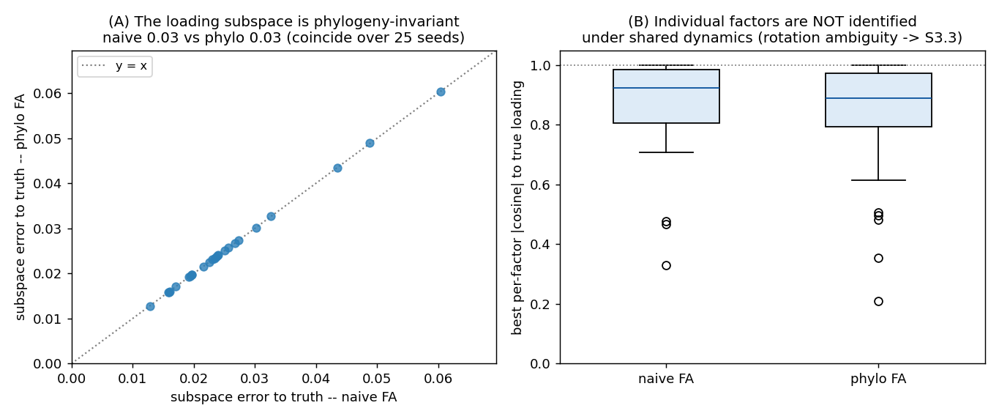
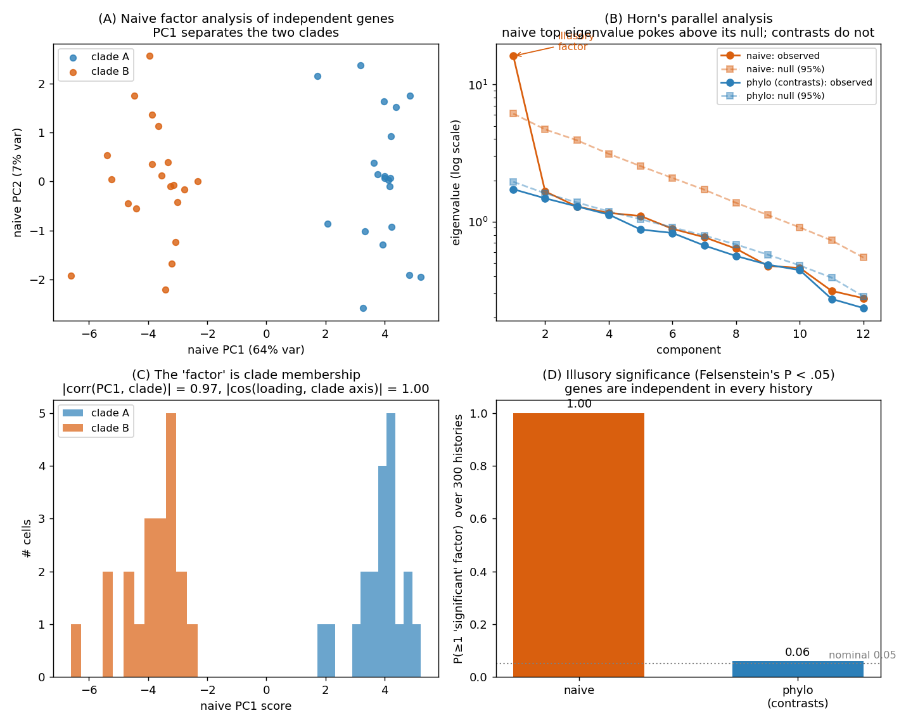

# Phylogenetic Factor Analysis

*Learning a small number of latent evolutionary "programs" behind transcriptome-wide
expression on a single-cell lineage tree, and asking how those factors differ from
the factors one would learn while ignoring the phylogeny.*

> **Prerequisites.** The latent-tree model, BM/OU, and the GMRF/pruning machinery of
> [`docs/01_methods.md`](01_methods.md). This chapter adds a *low-rank* structure on the
> genes: instead of a full gene-by-gene rate matrix, a few latent factors evolve on
> the tree and a loading matrix maps them to genes.

---

## 1. The model

A small number `k` of latent factors evolve along the tree; each cell's genes are a
linear readout of the factor values at its leaf:

```math
y_i \;=\; W x_i \;+\; \mu \;+\; \varepsilon_i, \qquad \varepsilon_i \sim \mathcal N(0,\Psi)\ \ (\Psi\ \text{diagonal}),
```

where `$`x_i \in \mathbb R^k`$` is the factor vector at leaf `$`i`$`, `$`W`$` is the `$`p\times k`$`
loading matrix (the gene "programs"), and `$`\Psi`$` is idiosyncratic per-gene noise.
Each factor `$`j`$` is an **independent** scalar Gaussian process on the tree (BM with a
rate, or OU with `$`(\alpha_j,\theta_j)`$`). Stacking the leaves, the marginal law of the
data is Gaussian with

```math
\operatorname{Cov}(\operatorname{vec} Y) \;=\; \sum_{j=1}^{k} C_j \otimes w_j w_j^\top \;+\; I_n \otimes \Psi ,
```

where `$`C_j`$` is the `$`n\times n`$` phylogenetic covariance of factor `$`j`$` and `$`w_j`$` is
its loading column. This is **phylogenetic factor analysis** (Tolkoff, Baele, Lemey &
Suchard 2018), the low-rank / transcriptome-wide counterpart of the full-`$`K`$` model in
`01_methods.md`: a linear decoder with latent BM factors induces a **low-rank-plus-diagonal**
evolutionary covariance `$`K = WW^\top + \Psi`$` in gene space.

When all factors share a single Brownian process (`$`C_j = C`$`), the per-factor rates fold
into the loading-column norms, leaving one shared `$`C`$` and a free `$`W`$`.

---

## 2. Phylogeny-aware vs. phylogeny-naive: one switch

The whole point is to compare factors learned **with** the tree against factors learned
**without** it. In this model that comparison is exact and airtight, because the two are
the *same estimator* differing in a single quantity — the cell (row) covariance:

| | row covariance | meaning |
|---|---|---|
| **phylogenetic FA** | `$`C`$` (tree) | cells correlated by shared ancestry |
| **naive FA** | `$`I_n`$` | cells i.i.d. — this is classical factor analysis |

Both maximize the identical Gaussian log-likelihood with the same parameter count; only
`$`C`$` vs `$`I_n`$` changes. The marginal likelihood diagonalizes in the eigenbasis of the row
covariance: with `$`C = U\,\mathrm{diag}(\lambda)\,U^\top`$` and rotated data `$`\tilde Y = U^\top Y`$`,
the rotated rows are independent Gaussians with per-row covariance `$`\lambda_i WW^\top + \Psi`$`,
each handled in `$`O(pk^2 + k^3)`$` by the Woodbury identity. Naive FA is the special case
`$`\lambda_i \equiv 1`$`.

```python
import scphytr as ph
fa_phylo = ph.tl.fit_phylo_factor_analysis(tree, Y, k=3)   # uses the tree covariance C
fa_naive = ph.tl.fit_factor_analysis(Y, row_cov=None, k=3) # classical FA (rows i.i.d.)
ph.tl.subspace_error(fa_phylo.W, fa_naive.W)               # compare loading subspaces
```

---

## 3. Two results that shape the method

### 3.1 The loading *subspace* is phylogeny-invariant (in expectation)

A natural hope is that PFA recovers the gene programs `$`W`$` better than naive FA. For the
shared-loadings model that is **not** true in expectation: the expected sample gene
covariance is

```math
\mathbb E[\hat S] \;=\; \gamma\, WW^\top + c\,\Psi, \qquad \gamma = \tfrac{1}{n}\operatorname{tr}C - \bar C ,
```

so the tree only *rescales* the factor variance — the eigenvectors (the loading
directions) are unchanged. Empirically, phylo and naive recover the **same** loading
subspace (Grassmann error coincides to two decimals; panel A), while neither pins down
the *individual* factors under shared dynamics (panel B) — the rotation ambiguity of
§3.3:



The phylogeny therefore does
**not** change *which subspace* the factors span; it changes (i) the variance of that
estimate in finite samples (effective sample size is reduced by ancestry), (ii) the
inferred factor *scores*, and (iii) — crucially — the **identifiability of individual
factors** (§3.3).

> **Read this expectation carefully.** `$`\mathbb E[\hat S]`$` averages over *replicate
> evolutionary histories*. We never observe replicates — we have **one** tree and one
> realized history. Conditional on that single history the picture is very different, and
> it is the practically relevant one: see §3.2.

### 3.2 Conditional on your tree, naive factor analysis invents factors (Felsenstein 1985)

Felsenstein's [1985](https://www.jstor.org/stable/2461605) "worst case": 40 species in
two clades of 20 close relatives, two characters evolving by **independent** Brownian
motion. There is no true relationship, yet a phylogeny-naive regression finds an
"illusory" significant correlation — because the 40 tips are pseudoreplicated and there
are really only ~2–3 independent points. His fix is to analyze the `$`n-1`$`
*phylogenetically independent contrasts*, which are i.i.d. and preserve the true
correlation (`$`\operatorname{Cov}[X_1-X_2, Y_1-Y_2] = 2v_1 s_x s_y r_{xy}`$`).

The same argument, in factor space, resolves the apparent tension with §3.1. Take genes
that are **evolutionarily independent** (`$`K`$` diagonal — *no true factor*) on a two-clade
tree, and run the *identical* "is there a factor?" test (Horn's parallel analysis) two
ways: on the raw leaves (naive) and on Felsenstein's contrasts (phylo). The result
([`make_felsenstein_figure.py`](figures/make_felsenstein_figure.py)):



- **Naive FA finds a "significant" top factor** explaining 64% of the variance whose
  loading is the deep clade-discriminating axis (`$`|\cos|=1.00`$` with the between-clade
  direction) and whose score is just *which clade a cell belongs to*
  (`$`|\mathrm{corr}|=0.97`$`). It is a phylogenetic artifact, not a gene program.
- **The contrast (phylo) test finds nothing** — correctly.
- Over 300 independent histories (genes always independent), naive declares ≥1 factor
  **100%** of the time; the contrast test does so **6%** of the time — the nominal 5%.

So **`$`\hat S`$`-invariance only says the spurious axis has random orientation across
hypothetical replicate trees**; it does nothing to protect the *one* dataset you analyze,
where the deep splits are a fixed, dominant axis of variance that naive FA extracts as a
top factor. This is exactly the confounding of `01_methods.md` §1.4, now for loadings: the
mechanism is pseudoreplication (a few deep divergences masquerading as low-rank
programs), and **phylogeny-aware FA = factor analysis on Felsenstein's independent
contrasts** = an eigen-decomposition of the deconfounded evolutionary rate matrix `$`K`$`,
which keeps real co-evolution while stripping the tree-induced structure.

### 3.3 Individual factors are identifiable only with *heterogeneous* dynamics

Factor analysis is invariant to a rotation of the factors: `$`W \mapsto WR`$`,
`$`x \mapsto R^\top x`$` for any orthogonal `$`R`$` leaves the likelihood unchanged. So with a
single shared evolutionary process (even with the tree) only the *subspace* is
identified — the individual factors are arbitrary, and "factor 2 is the OU one" is
meaningless.

**Heterogeneous dynamics break this symmetry.** If factors evolve by *different*
processes (BM vs OU, or different rates), each `$`C_j`$` differs, the rotation no longer
leaves `$`\sum_j C_j \otimes w_j w_j^\top`$` invariant, and the factors — and their
loadings — become **individually identified**. This is the precise sense in which
"factors learned with a phylogeny are different": with homogeneous dynamics they are
rotation-ambiguous, while phylogeny *plus heterogeneous dynamics* pins down each gene
program and lets us label it BM or OU and read off its rate.

---

## 4. Per-factor dynamics: which factors are BM, which are OU, and the rates

Two routes are implemented:

- **`classify_factor_dynamics(tree, fitted)`** — fit a shared-BM PFA, then run the
  univariate BM-vs-OU model selection of `model_selection` on each inferred factor
  trajectory (the factors are themselves traits on the tree). Cheap; but inherits the
  rotational ambiguity of §3.3, so the per-factor labels are only meaningful when the
  factors are already separated.

- **`detect_factor_dynamics(tree, Y, k)`** — *jointly* fit the loadings and per-factor
  dynamics, enumerating the `$`2^k`$` BM/OU configurations and selecting by AIC/BIC on the
  exact marginal likelihood. This is the principled estimator (it exploits §3.3 to
  identify the factors), and it works on well-separated cases.

```python
best, all_fits = ph.tl.detect_factor_dynamics(tree, Y, k=2, criterion="aic")
best.summary()        # per-factor dynamics, OU alpha, tip-variance
```

### Status and known limitations (important)

`detect_factor_dynamics` is currently a **prototype**. On well-separated factors it
recovers the configuration and individual loadings correctly; in harder regimes it is
**not yet trustworthy**, for two reasons we have characterized:

1. **Low BM-vs-OU power for small trees** (`$`n \lesssim 64`$`). A single BM trajectory can
   look like weakly-selected OU, so the AIC gap between configurations is within noise.
   This is the well-known low power of OU-vs-BM tests, not a software bug; it improves
   with the number of leaves.
2. **A degenerate likelihood mode.** The dense `$`O((np)^3)`$` objective can collapse one
   factor (rank reduction — one loading norm explodes while another factor's loading
   becomes unrecoverable) at a *lower* negative log-likelihood than the truth.
   Normalizing each `$`C_j`$` to unit mean tip-variance (so variance is carried only by the
   loading norm and `$`\alpha`$` shapes only the autocorrelation) did not remove it, so it is
   a genuine property of the surface that needs regularization or a different engine.

**Open work** (any of these would make detection robust):

- warm-start the joint fit from the naive/Procrustes solution and add a penalty on the
  loading-column norms (or a floor on `$`\Psi`$`) to remove the rank-collapse mode;
- replace the dense `$`O((np)^3)`$` fit with the **scalable EM** (latent factor scores as
  the E-step, reusing the tree smoother of `01_methods.md` §8.3), so we can reach the
  hundreds–thousands of leaves where BM-vs-OU power is adequate;
- propagate factor-score uncertainty into the per-factor classification.

---

## 5. Counts: Poisson phylogenetic factor analysis

Everything so far is **Gaussian** — log-expression as a real-valued linear readout with additive
noise. Single-cell data are **raw counts**, and the honest likelihood is Poisson. We keep the
low-rank evolutionary structure of §1 but swap the Gaussian readout for a Poisson one. This is the
count analogue of phylogenetic factor analysis, and the **low-rank counterpart of the full-`$`K`$`
Poisson model** of [`01_methods.md`](01_methods.md) §7–§8: there each of `$`p`$` genes carries its own
latent log-rate with a full `$`p\times p`$` diffusion; here a handful of factors do, and a loading
map fans them out to the genes.

> **Goal, kept in frame.** Recover, from raw counts, (i) a small set of **deconfounded gene
> programs** (the loadings `$`W`$`) and (ii) the **gene–gene evolutionary correlation matrix**
> `$`\operatorname{corr}(WW^\top)`$`, at transcriptome scale — i.e. the same scientific outputs as
> §1–§4, but for counts and for many genes.

### 5.1 The model

`$`k`$` latent factors evolve as **independent unit-rate Brownian motions on the tree**; a loading
matrix `$`W\in\mathbb R^{p\times k}`$` maps them to per-gene log-rates; counts are Poisson with a
per-cell size factor `$`s_i`$`:

```math
x_{\cdot j}\sim\mathcal N(0,C)\ \ (j=1,\dots,k),\qquad
\eta_{ig}=\mu_g+(W x_i)_g,\qquad
y_{ig}\sim\mathrm{Poisson}\!\big(s_i\,e^{\eta_{ig}}\big). \quad (5.1)
```

Because the factors are independent unit-rate BMs (diffusion `$`I_k`$`) and the readout is linear,
the **gene log-rates `$`\eta_i = W x_i`$` are themselves a multivariate Brownian motion** with
diffusion matrix

```math
\boxed{\,K \;=\; W\,I_k\,W^\top \;=\; W W^\top\,}\qquad(\text{rank } k,\ \text{on the log-rate scale}). \quad (5.2)
```

So the gene–gene evolutionary covariance is **not** discarded by the factorization — it *is*
`$`WW^\top`$`, the rank-`$`k`$` restriction of the full `$`K`$` of methods §7. Two genes co-evolve to
the extent they load on the same factors with the same sign; `$`\operatorname{corr}(WW^\top)`$` is
the deconfounded correlation. "Independent factors" is a **gauge, not a restriction**: any rank-`$`k`$`
PSD `$`K`$` factors as `$`WW^\top`$`, and a rotation `$`W\mapsto WR`$` leaves `$`WW^\top`$` unchanged, so
correlations come from *shared loadings*, never from factor correlations (§3.3). As always, it is
the **tree prior** `$`x_{\cdot j}\sim\mathcal N(0,C)`$` that makes `$`WW^\top`$` the *heritable*
(deconfounded) covariance rather than the phylogeny-naive one (§3.2).

### 5.2 Inference: Laplace-EM in the factor latent (`$`O(Nk^3)`$`)

The decisive implementation move is to **set the per-node latent dimension to `$`k`$` (the factors),
not `$`p`$` (the genes)**. The latent field `$`x`$` is a `$`k`$`-vector at every node with the Kronecker
prior precision `$`A\otimes I_k`$` of methods §7, so the whole multivariate tree-Laplace machinery
applies *verbatim* — at cost `$`O(Nk^3)`$` instead of `$`O(Np^3)`$`.

The **one** new ingredient relative to methods §7 is the shape of the leaf curvature. There the
Poisson likelihood was conditionally independent across genes, so the observation Hessian was
**diagonal**. Here the loading `$`W`$` makes each gene depend on *all* `$`k`$` factors, so the leaf
curvature is a **full `$`k\times k`$` block**,

```math
-\nabla^2_{x_i}\,\ell_i \;=\; W^\top \operatorname{diag}\!\big(s_i e^{\eta_i}\big)\,W \ \succeq 0, \quad (5.3)
```

(positive-semidefinite, so the mode problem stays log-concave). Block Gaussian elimination already
factorizes a dense block per node, so accepting a full `$`k\times k`$` curvature instead of a diagonal
one costs nothing asymptotically — `_MVTreeModel._eliminate` was generalized to take either.

Fitting `$`(W,\mu)`$` by **maximum likelihood** is Laplace-EM:

- **E-step** — the Laplace posterior of the factor scores (mode `$`\hat x`$` and covariance blocks
  `$`\Sigma_i`$`) via the tree smoother of methods §8.3, now in `$`k`$` dimensions.
- **M-step** — maximize the *expected* complete-data Poisson log-likelihood (the "Q-function" of
  methods §8.3) over `$`(W,\mu)`$`. Because the likelihood factorizes over genes, this splits into one
  problem per gene `$`g`$`,

```math
\mathcal Q_g(\mu_g, W_g) = \sum_{i\in\mathcal L}\Big(\,y_{ig}\,\underbrace{\mathbb E[\eta_{ig}]}_{\mu_g + W_g\hat x_i}\; -\; s_i\,\underbrace{\mathbb E[e^{\eta_{ig}}]}_{\text{(5.4)}}\,\Big),\qquad W_g = g\text{-th row of }W. \quad (5.4')
```

  The only non-trivial term is `$`\mathbb E[e^{\eta_{ig}}]`$`. Under the Gaussian (Laplace) posterior
  the scalar `$`\eta_{ig}=\mu_g+W_g x_i`$` is itself Gaussian with mean `$`\mu_g+W_g\hat x_i`$` and
  variance `$`W_g\Sigma_i W_g^\top`$`, so its exponential has the standard **log-normal mean**

```math
\mathbb E\big[e^{\eta_{ig}}\big]
= \exp\!\Big(\underbrace{\mu_g + W_g\,\hat x_i}_{\text{posterior mean}} + \tfrac12\,\underbrace{W_g\,\Sigma_i\,W_g^\top}_{\text{posterior variance}}\Big). \quad (5.4)
```

  (The `$`+\tfrac12\text{Var}`$` is the *latent-uncertainty correction*: ignoring it — plugging in the
  mode `$`\hat x`$` — would systematically under-estimate the rate.) Each `$`\mathcal Q_g`$` is **concave
  in `$`(\mu_g, W_g)`$`** — it is a linear term minus `$`s_i\exp(\text{affine}+\text{const})`$`, and
  `$`-\exp`$` of an affine function is concave — so the M-step is a fast, reliable per-gene
  Newton/L-BFGS solve with a unique maximum.

This is `fit_poisson_factor_analysis`; EM increases the Laplace marginal monotonically.
`evolutionary_covariance()` returns `$`WW^\top`$` and `evolutionary_correlation()` returns
`$`\operatorname{corr}(WW^\top)`$`.

```python
import scphytr as ph
fit = ph.tl.fit_poisson_factor_analysis(counts, tree, k=10)   # raw counts in, ML
R   = fit.evolutionary_correlation()                          # deconfounded gene-gene corr
```

### 5.3 What is novel, and what is literature

The pieces are individually classical; the **combination is new**.

| Ingredient | Closest prior art | Has a tree? | Likelihood | Objective |
|---|---|---|---|---|
| Gaussian PFA (§1) | Tolkoff et al. 2018 | yes (BM/OU) | Gaussian | exact marginal |
| Poisson/PLN factor analysis | Chiquet et al. 2018 (PLN-PCA); Townes 2019 (GLM-PCA) | **no** | Poisson/NB | VI / penalized MAP |
| Tree latent + counts | TreeVAE (Lopez et al. 2021) | yes (BM walk) | NB, **nonlinear** decoder | amortized VI |
| **`scPhyTr` Poisson PFA** | — | **yes (BM/OU)** | Poisson, **linear** | **exact-marginal Laplace-EM, `$`O(Nk^3)`$`** |

The novel object is a **low-rank, tree-structured, exact-marginal** count factor model: a BM/OU
prior on the factor *scores* (so the factors carry interpretable evolutionary dynamics, §4) with a
log-linear Poisson readout fit by Laplace-EM, rather than the amortized VI of TreeVAE or the
tree-free VI/MAP of PLN-PCA / GLM-PCA. The log-linear link is what keeps the marginal near-exact
and `$`WW^\top`$` interpretable as the deconfounded evolutionary covariance.

### 5.4 Validation

`docs/figures/validate_poisson_factor.py` simulates from (5.1) and refits. Over five replicate
trees (`$`n=300,\ p=45,\ k=3`$`): EM is **monotone in every replicate**; the loading **subspace** is
recovered with Grassmann error `$`\approx 0.21`$` (of a maximum `$`\sqrt k\approx1.73`$`) and principal
angles `$`\le 10^\circ`$`; and the gene–gene **correlation matrix `$`\operatorname{corr}(WW^\top)`$` is
recovered at `$`r\approx 0.90`$`** against the truth. The Poisson fit matches the Gaussian PFA of §1
to three decimals on the same data, and — exactly as the invariance result of §3.1 predicts —
phylogenetic and naive fits recover the **same subspace** (`$`0.213`$` vs `$`0.212`$`); the tree's
effect is on the factor scores, their dynamics, and significance, not on the static subspace.

### 5.5 The idiosyncratic-heritable term: `$`K = WW^\top + D`$`

The pure factor model (5.2) forces **all** of a gene's heritable variance through the `$`k`$` shared
factors. A gene with mostly *private* heritable variation is then misfit: to explain its variance
the model inflates its loading, which spuriously inflates its correlations with everything else on
that factor. The remedy is the count analogue of PFA's idiosyncratic term: give each gene its own
**private Brownian motion** `$`u_{\cdot g}\sim\mathcal N(0, d_g C)`$` on the tree, so
`$`\eta_{ig}=\mu_g+(Wx_i)_g+u_{ig}`$` and

```math
\boxed{\,K \;=\; W W^\top + \operatorname{diag}(d)\,.} \quad (5.5)
```

A subtle but important contrast with the Gaussian PFA `$`K=WW^\top+\Psi`$` of §1: there `$`\Psi`$` is
idiosyncratic **measurement** noise (non-heritable); here `$`\Psi\!\to\!D`$` is a **heritable**
(tree-structured) per-gene variance, because in a count model the Poisson sampling already plays the
role of measurement noise. With `$`d_g>0`$` the correlations attenuate correctly:
`$`\operatorname{corr}(K)_{gg'} = W_g\!\cdot\!W_{g'} / \sqrt{(\lVert W_g\rVert^2+d_g)(\lVert W_{g'}\rVert^2+d_{g'})}`$`.

**Estimator.** We fit (5.5) as a *regularized gene-level* model
(`fit_mv_em(tree, obs, k_factor=k)`). The E-step is the same full `$`p`$`-dim Laplace E-step as the
unconstrained `$`K`$` of methods §8.3, which yields the unconstrained MLE of the diffusion as the
average per-edge increment covariance,

```math
\hat C = \frac{1}{N_{\text{free}}}\sum_u \frac{\mathbb E[\Delta z_u\,\Delta z_u^\top]}{v_u}
\qquad(\Delta z_u = z_u - \phi_u z_{\mathrm{pa}(u)} - c_u,\ \text{methods §8.3}).
```

The M-step then **projects `$`\hat C`$` onto the low-rank-plus-diagonal family**: it finds the
`$`(W,d)`$` whose `$`WW^\top+\operatorname{diag}(d)`$` best fits `$`\hat C`$`. This sub-problem is
*classical factor analysis of a covariance matrix*, solved by the **Rubin & Thayer (1982) EM** —
alternating (a) the conditional regression of the latent factors on `$`\hat C`$` and (b) a
closed-form update of `$`W`$` and `$`d`$` — implemented in `_factor_analyze_cov`. Because constraining
the M-step's `$`K`$` to the factor family is still a valid (generalized) M-step that does not decrease
`$`\mathcal Q`$`, EM stays monotone — verified empirically.

Note this estimator keeps the `$`p`$`-dim latent, so it is `$`O(Np^3)`$`: it **regularizes** the
gene-level estimate (`$`pk+p`$` parameters rather than `$`p^2/2`$`) but does not yet **accelerate** it;
the `$`O(Nk^3)`$` fast path *with* a `$`D`$` term is open work (§6).

---

## 6. Full vs factor: a ground-truth comparison

Which estimator should you use for gene–gene correlations: the **full** `$`p\times p`$` `$`K`$` (methods
§8), the **rank-`$`k`$`** `$`WW^\top`$` (§5.2), or the **regularized** `$`WW^\top+D`$` (§5.5)? We answer
on simulated ground truth. We draw the latent gene log-rates from a **matrix-normal** law — i.e. a
multivariate BM whose `$`n`$` cells are correlated by the tree (row covariance `$`C`$`) and whose `$`p`$`
genes are correlated by a *known* `$`K_{\text{true}}`$` (column covariance) — then emit Poisson counts.
The *same* generator and the *same* counts feed all three estimators, so the comparison is fair; and
we test both a genuinely **low-rank** `$`K_{\text{true}}=WW^\top`$` (which the factor model can fit
exactly) and a **full-rank** one (which it cannot), to see each estimator's behaviour under its own
assumptions and under misspecification. The score is the Pearson correlation between the estimated
and true *off-diagonal* entries of `$`\operatorname{corr}(K_{\text{true}})`$`. Driver:
`docs/figures/compare_genelevel_vs_factor.py`.

Averaged over seeds at `$`n=120,\ p=16,\ k=3`$` (Pearson `$`r`$` of estimated vs true off-diagonal
correlations; higher is better):

| truth | counts | gene-level `$`K`$` | factor `$`WW^\top`$` | factor+idio `$`WW^\top{+}D`$` | wall-time (gl / fa / +idio) |
|---|---|---|---|---|---|
| low-rank | deep (~3000 UMI) | **0.952** | 0.815 | 0.933 | 33 s / 0.3 s / 9 s |
| low-rank | shallow (~120 UMI) | **0.776** | 0.606 | 0.771 | 32 s / 0.5 s / 9 s |
| full-rank (AR1) | deep | **0.891** | 0.691 | 0.829 | 33 s / 0.4 s / 6 s |
| full-rank | shallow | **0.588** | 0.498 | 0.562 | 35 s / 0.4 s / 10 s |

Three lessons, each worth keeping in frame:

1. **The unconstrained `$`K`$` is the most accurate estimator where it is affordable.** With `$`n>p`$`
   and informative counts, the latent log-rates are nearly directly observed, so the full MLE — which
   estimates every pairwise covariance — wins in all four regimes. Regularization helps recovery only
   when data are scarce relative to `$`p`$`.
2. **The idiosyncratic term closes most of the factor model's gap.** Adding `$`D`$` lifts correlation
   recovery by `$`+0.08`$` to `$`+0.16`$` over the pure rank-`$`k`$` fit, landing within `$`0.02`$`–`$`0.06`$`
   of the full `$`K`$` — confirming the §5.5 mechanism (the pure factor model over-attributes per-gene
   variance and distorts correlations; `$`D`$` absorbs the private part). We verified the pure Poisson
   factor model is not at fault: it matches the Gaussian PFA to three decimals.
3. **The factor model's payoff is computational, not statistical.** It is `$`\sim100\times`$` faster
   here and, being `$`O(Nk^3)`$`, is the *only feasible* estimator when `$`p`$` is in the
   hundreds–thousands. The regime where the structured estimators would *beat* full `$`K`$` on accuracy
   is `$`p>n`$` (where the empirical `$`K`$` goes rank-deficient) — which is exactly where full `$`K`$` is
   too expensive to run: a `$`p{=}50,\ n{=}30`$` full fit did not finish in 15 minutes, while the factor
   fit took 0.2 s.

**Recommendation.** Use the **full `$`K`$`** when `$`p`$` is small enough to fit it (tens of genes);
use **`$`WW^\top{+}D`$`** for a regularized estimate at moderate `$`p`$`; use the **`$`O(Nk^3)`$` pure
factor model** at transcriptome scale, accepting a quantified accuracy cost.

### Where to go next

- **An `$`O(Nk^3)`$` fast path with the idiosyncratic term.** Today `$`WW^\top{+}D`$` is fit in the
  `$`p`$`-dim latent (`$`O(Np^3)`$`). Keeping the `$`k`$`-factor latent *and* a per-gene private BM gives a
  joint latent of dimension `$`k+p`$` whose curvature has a **diagonal** `$`p\times p`$` block (the
  private part) — eliminable by a Schur complement onto the `$`k`$` factors in `$`O(p k^2)`$` per node.
  This would deliver the regularized estimator at factor-model speed.
- **Negative-binomial overdispersion** (a per-gene dispersion on top of the log-rate), for the
  excess-Poisson variation real UMI counts show.
- **Per-factor dynamics on the Poisson factors** — run the §4 BM-vs-OU machinery on the inferred
  Poisson factor trajectories to label count programs as drift vs selection.
- **Real data.** Apply `$`\operatorname{corr}(WW^\top{+}D)`$` to a KP-Tracer tumour and contrast with
  the phylogeny-naive and Hotspot-module correlations (see [`04_real_data_kptracer.md`](04_real_data_kptracer.md)).

---

## 7. Software map

| Concern | Symbol |
|---|---|
| Phylo / naive Gaussian FA (one switch) | `tools.factor_analysis.fit_factor_analysis`, `fit_phylo_factor_analysis` |
| Posterior factor trajectories | `FittedFactorModel.factor_scores` |
| Loading-subspace comparison | `subspace_error`, `principal_angles`, `procrustes_align` |
| Per-factor dynamics (inferred-trajectory route) | `classify_factor_dynamics` |
| Per-factor dynamics (joint fit, **prototype**) | `detect_factor_dynamics`, `FittedDynamicFactorModel` |
| Gaussian-FA simulation | `simulate_pfa` |
| **Poisson PFA (§5): ML fit, `$`K=WW^\top`$`** | `tools.poisson_factor.fit_poisson_factor_analysis`, `FittedPoissonFactorModel` |
| **Poisson PFA: `$`K`$`, `$`\operatorname{corr}(K)`$`** | `FittedPoissonFactorModel.evolutionary_covariance / _correlation` |
| **Poisson PFA simulation** | `tools.poisson_factor.simulate_poisson_pfa` |
| **Regularized `$`K=WW^\top{+}D`$` (§5.5)** | `tools.em.fit_mv_em(..., k_factor=k)`; `tools.em._factor_analyze_cov` |
| Full `$`k\times k`$` leaf curvature (§5.2) | `inference.tree_laplace_mv._MVTreeModel._obs_block` |
| Subspace-invariance figure (§3.1) | `docs/figures/make_subspace_figure.py` |
| Felsenstein illusory-factor demo (§3.2) | `docs/figures/make_felsenstein_figure.py` |
| Per-factor dynamics figure driver (prototype) | `docs/figures/make_factor_figures.py` |
| **Poisson PFA validation (§5.4)** | `docs/figures/validate_poisson_factor.py` |
| **Full-vs-factor comparison (§6)** | `docs/figures/compare_genelevel_vs_factor.py` |

---

## 8. References

- Tolkoff, M. R., Alfaro, M. E., Baele, G., Lemey, P. & Suchard, M. A. (2018).
  *Phylogenetic factor analysis.* Systematic Biology 67:384–399.
- Townes, F. W. et al. (2019). *Feature selection and dimension reduction for
  single-cell RNA-seq based on a multinomial model (GLM-PCA).* Genome Biology 20:295.
- Chiquet, J., Mariadassou, M. & Robin, S. (2018). *Variational inference for
  probabilistic Poisson PCA / Poisson log-normal models.* (Low-rank latent Gaussian
  count factor analysis, **no tree**.)
- Rubin, D. B. & Thayer, D. T. (1982). *EM algorithms for ML factor analysis.*
  Psychometrika 47:69–76. (The `$`WW^\top+D`$` M-step of §5.5.)
- Lopez, R. et al. (2021). *Reconstructing unobserved cellular states from paired
  single-cell lineage tracing and transcriptomics data (TreeVAE).* (Tree-prior latent +
  nonlinear decoder + amortized VI — the nonlinear cousin of §5.)
- Felsenstein, J. (1985). *Phylogenies and the comparative method.* American Naturalist
  125:1–15. (Phylogenetic non-independence / confounding.)
