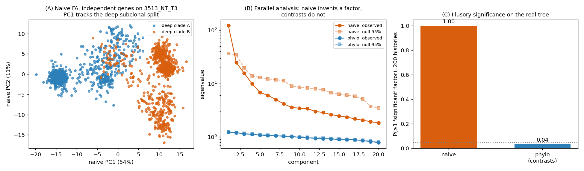
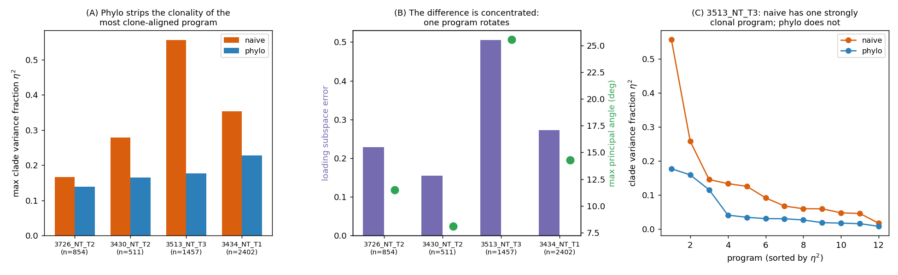
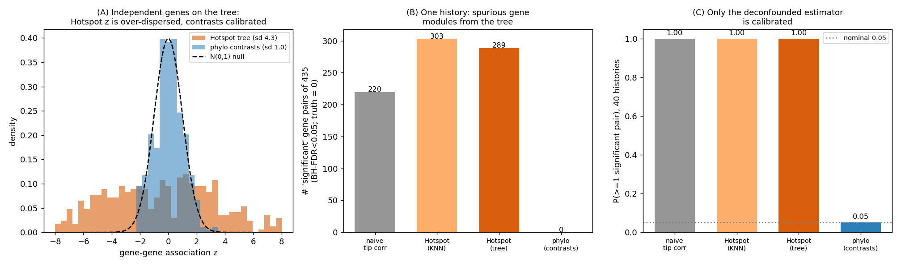
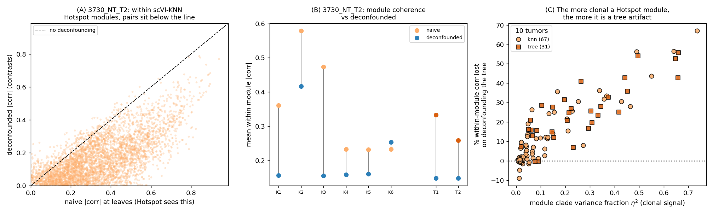

# Phylogeny-aware vs. naive factor analysis on a real tumor lineage

*Do the gene programs learned by matrix factorization change when we account for
the cell phylogeny? An end-to-end study on the KP-Tracer mouse lung-adenocarcinoma
lineage-tracing atlas.*

> **Context.** This applies the phylogenetic factor analysis of
> [`03_factor_analysis.md`](03_factor_analysis.md) and the Felsenstein confounding lens
> of its §3.2 to real CRISPR/Cas9 single-cell lineage-tracing data. The headline
> question: *does a phylogeny-naive factorization learn different programs than a
> phylogeny-aware one, and if so, which programs and why?*

---

## 1. Data

Yang\*, Jones\* et al. ([*Cell* 2022](https://doi.org/10.1016/j.cell.2022.04.015),
"Lineage recording reveals the phylodynamics, plasticity, and paths of tumor
evolution") profiled an autochthonous *Kras;Trp53* (KP) mouse model of lung
adenocarcinoma with an evolving CRISPR/Cas9 lineage tracer and a scRNA-seq
readout. Per clonal tumor they reconstructed a single-cell phylogeny with
[Cassiopeia](https://github.com/YosefLab/Cassiopeia). We use the processed sgNT
data (Zenodo `5847462`): an integrated AnnData of 58,022 cells × 27,998 genes
(log-normalized; the authors' `leiden_sub`/`Cluster-Name` cell-state labels) and
per-tumor Newick trees with unit (mutational-step) branch lengths.

Each analysis is **within one tumor**: leaves are cell barcodes, which we
intersect with the expression matrix, take the top-1,000 highly-variable genes,
and build the Brownian shared-time covariance `$`C`$` from the tree in a single
traversal (the loader, `analysis/kptracer/load.py`). We study the four most
heterogeneous, high-fitness/plasticity tumors (the paper's highlighted cases):
`3726_NT_T2`, `3430_NT_T2`, `3513_NT_T3`, `3434_NT_T1` (511–2,402 cells).

The comparison is the **one-switch** design: the same Gaussian factor model with
row covariance `$`C`$` (phylo) vs. `$`I`$` (naive).

---

## 2. A ground-truth control: Felsenstein on the real tree

Before touching real expression we sanity-check on the real tree *topology* with
simulated data we control. We put **evolutionarily independent** genes on the
tumor tree (`$`K`$` diagonal — no true gene program) and ask the same "is there a
factor?" question (Horn's parallel analysis) on the raw leaves (naive) and on
Felsenstein's independent contrasts (phylo). Driver:
`analysis/kptracer/semisynth_real_tree.py`.



On `3513_NT_T3` (1,457 leaves), naive factor analysis declares an "illusory" top
program explaining 54% of variance whose loading is **0.99 cosine-aligned with
the tumor's deepest subclonal split**; the contrast (phylo) test finds nothing.
Over 200 simulated histories the naive test invents ≥1 program **100%** of the
time vs **4%** for phylo (the nominal 5%). On the more unbalanced `3726_NT_T2`
naive invents *several* spurious programs (mean 5.5) — unbalanced trees have many
deep splits, so more pseudoreplication. **The Felsenstein confounding is real on
these tree shapes**, so any difference we see on real data has a principled cause,
and the phylo (contrast) machinery is well-calibrated.

---

## 3. Real expression: the difference is real but *concentrated*

Fitting naive and phylo factor analysis (k = 12) to the real log-normalized HVG
matrix of each tumor (`analysis/kptracer/real_data_compare.py`,
`summary_figure.py`):



| tumor | cells | subspace error | max principal angle | naive max `$`\eta^2`$` | phylo max `$`\eta^2`$` |
|---|---|---|---|---|---|
| 3726_NT_T2 | 854 | 0.23 | 11.5° | 0.17 | 0.14 |
| 3430_NT_T2 | 511 | 0.15 | 8.1° | 0.28 | 0.16 |
| **3513_NT_T3** | 1457 | **0.51** | **25.6°** | **0.56** | 0.18 |
| 3434_NT_T1 | 2402 | 0.27 | 14.3° | 0.35 | 0.23 |

Here `$`\eta^2`$` is the fraction of a program's variance lying *between* deep
clones (projecting the same centered data onto each unit loading) — high `$`\eta^2`$`
means the program is a **clonal-identity / phylogenetic axis**, low means
within-clone **co-regulation**.

Three honest takeaways:

1. **Most programs are shared.** The bulk of the factorization — the cell-state
   programs (AT2-like, AT1-like, EMT, gastric) — recurs across clones and is *not*
   phylogenetically confounded, so naive and phylo recover it almost identically
   (matched program cosine median 0.96–0.99; most principal angles < 3°). This is
   the expectation-level subspace invariance of `03_factor_analysis.md` §3.1.

2. **The difference is concentrated on the clonal axis.** In heterogeneous tumors
   there is typically **one** program that naive factor analysis builds along
   clonal identity (large `$`\eta^2`$`) and that phylo factor analysis deconfounds:
   in `3513_NT_T3` the most clone-aligned naive program has `$`\eta^2 = 0.56`$`,
   while phylo's most clonal program has only `$`0.18`$`, and exactly one program
   rotates strongly (last principal angle 25.6°). Across all four tumors, phylo
   reduces the clonality of the most clone-aligned program (panel A).

3. **Which program?** In `3513_NT_T3` the deconfounded naive program loads on
   **Dlk1, Meg3** (imprinted genes; known heritable clonal markers in this
   system), **Crip1**, and **Ager** (an AT1 marker). This is precisely a
   clonal-identity axis: cells share it because they share ancestry, not because
   it is a distinct co-regulation program among the cell states. Phylo factor
   analysis attributes that structure to the tree prior and returns programs
   dominated by within-clone co-regulation instead.

### Interpretation (and an important caveat)

Phylo factor analysis does **not** declare the clonal program "wrong" — Dlk1/Meg3
heritability is real biology. It *reattributes* that variation to shared ancestry
rather than counting it as one of the independent co-regulation programs. Which
you want depends on the question (`03_factor_analysis.md` §3.2): if you want programs
that represent transcriptional *modules*, the naive clonal program is a confound
to remove; if you are mapping heritable clonal states, it is the signal. The
contribution here is that the two factorizations **differ in a predictable,
localized way** — on the clone-aligned axis — and the phylogeny tells you exactly
which program that is.

---

## 4. The same confounding breaks **Hotspot** gene modules

The factor-analysis story above is about *programs* (linear combinations of
genes). The paper also reports gene **modules** — groups of highly correlated
genes — using [Hotspot](https://doi.org/10.1016/j.cels.2021.04.005) (DeTomaso &
Yosef, *Cell Systems* 2021). It is worth asking the same question of those
modules, because module discovery is exactly a gene-gene *correlation* problem,
and gene-gene correlation across cells is where the phylogeny does the most
damage.

### 4.1 Why Hotspot is confounded by the tree

Hotspot builds modules in two steps, both scored against a **cell-exchangeability
null**. For a cell–cell adjacency `$`W`$` (a KNN graph in a latent space — the
authors used scVI in their Figure 3 — or an explicit phylogeny in PhyloVision
tree mode) it computes, for genes `$`g,h`$`,

- a per-gene autocorrelation `$`H_g = \sum_{ij} W_{ij}\,x_{g,i}x_{g,j}`$`, and
- a pairwise local correlation `$`LC_{gh} = \sum_{ij} W_{ij}\,x_{g,i}x_{h,j}`$`,

each turned into a `$`Z`$`-score under the null that a gene's values are i.i.d.
across cells, then clusters the `$`LC`$`-matrix into modules. The null is that,
absent signal, **cells are exchangeable**. But the cells are leaves of a
phylogeny, so they are not: closely related cells share expression by descent.
The consequences are Felsenstein's (§2), now for modules:

- A gene that merely **drifts** (neutral Brownian motion) along the tree is
  autocorrelated on any lineage-respecting graph, so Hotspot flags it as
  "significant" with *no* co-regulation — only heritability.
- Two genes that drift **independently** (zero evolutionary correlation,
  `$`K`$` diagonal) both track the lineage, so `$`\sum_{ij}W_{ij}x_{g,i}x_{h,j}`$`
  is inflated relative to the exchangeable null and they land in the same module.

Structurally, `$`LC_{gh}`$` is a graph-smoothed **tip** cross-product: it
estimates a quantity proportional to the tip covariance `$`C \otimes K`$`, not the
evolutionary covariance `$`K`$`. The tree factor `$`C`$` manufactures gene-gene
correlation even when `$`K`$` is diagonal. scPhyTr targets `$`K`$` directly
(equivalently, works on Felsenstein contrasts), so a module = a block of `$`K`$`
means genes genuinely *co-evolve*, not merely co-drift down shared branches.

### 4.2 Ground-truth control: Hotspot invents modules from the tree

We put **evolutionarily independent** genes (`$`K`$` diagonal — no true module) on
the real `3726_NT_T2` tree and run the *actual* `hotspotsc` package four ways,
BH-correcting every method identically
(`analysis/kptracer/hotspot_confounding_sim.py`):



With **no true co-regulation**, tree-mode Hotspot flags **all 30/30 genes** as
significantly autocorrelated; its gene-gene `$`Z`$` is over-dispersed to
**sd ≈ 4.3** (nominal 1.0; panel A), calls **302 of 435 gene pairs** significant,
and `create_modules` returns **2 modules** out of thin air. Naive leaf correlation
(220 pairs) and the scVI-KNN Hotspot (290) are just as confounded. Felsenstein
contrasts — scPhyTr's estimator — stay calibrated (`$`Z`$` sd 1.0, **0** pairs).
Over 30 simulated histories, P(≥1 "significant" gene pair) is **1.00** for the
naive/Hotspot methods vs **0.03** for the deconfounded estimator (nominal 0.05;
panel C). **Every Hotspot module here is a tree artifact.**

### 4.3 Real expression: clonal modules are largely the tree

On real data we reproduce the paper's module step (Hotspot on the scVI-KNN graph)
*and* run tree-mode Hotspot, per tumor. For each module we compare its mean
within-module `$`|\,\text{corr}\,|`$` at the leaves (what Hotspot responds to) to
the **deconfounded** correlation on contrasts, and measure the module's clade
variance fraction `$`\eta^2`$` (`analysis/kptracer/hotspot_vs_phylo_real.py`):



Pooling **67 scVI-KNN modules across 10 tumors**, the shrinkage on deconfounding
tracks clonality almost monotonically: **Spearman(`$`\eta^2`$`, shrinkage) = 0.84**
(panel C). Modules that are mostly co-regulation (`$`\eta^2 < 0.1`$`, i.e. the
cell-state programs) lose only **4%** of their coherence — Hotspot got those
right. But clonal modules (`$`\eta^2 > 0.2`$`) lose **35%** on average, and the
worst cases are mostly tree: in `3730_NT_T2` one scVI module's within-module
`$`|\,\text{corr}\,|`$` collapses **0.47 → 0.16** (67% of its "co-expression" was
shared ancestry; `$`\eta^2 = 0.74`$`; panels A–B). Tree-mode (PhyloVision) modules
show the same pattern (Spearman 0.75).

**Takeaway.** Hotspot conflates *heritability* with *co-regulation*. Where
expression is not clonally structured its modules are fine; where a module aligns
with clonal identity, much of its apparent co-expression is the phylogeny, and a
tree-naive correlation will overstate it. Estimating the evolutionary covariance
`$`K`$` directly (the off-diagonal of `$`K`$`, via contrasts / phylogenetic factor
analysis) recovers the deconfounded gene–gene correlation — the "true" module
structure scPhyTr is after.

---

## 5. Reproducing

```bash
# 1. download + extract (Zenodo 5847462); see analysis/kptracer/README
#    expression/adata_processed.nt.h5ad  and  trees/{tumor}_tree.nwk
# 2. ground-truth control on the real tree
python -m analysis.kptracer.semisynth_real_tree
# 3. real-data factor-analysis comparison + cross-tumor summary
python -m analysis.kptracer.summary_figure
# 4. Hotspot confounding: ground-truth control + real modules (needs `hotspotsc`)
python -m analysis.kptracer.hotspot_confounding_sim
python -m analysis.kptracer.hotspot_vs_phylo_real
```

| Concern | File |
|---|---|
| Loader (tree + log-norm HVG, fast shared-time `$`C`$`) | `analysis/kptracer/load.py` |
| Contrast / parallel-analysis / clade helpers | `analysis/kptracer/phylo_factor_utils.py` |
| Felsenstein control on the real tree | `analysis/kptracer/semisynth_real_tree.py` |
| Naive vs phylo on real expression | `analysis/kptracer/real_data_compare.py` |
| Cross-tumor summary figure | `analysis/kptracer/summary_figure.py` |
| Hotspot wrappers + deconfounded correlation | `analysis/kptracer/hotspot_utils.py` |
| Hotspot confounding ground-truth control | `analysis/kptracer/hotspot_confounding_sim.py` |
| Hotspot modules vs deconfounded `$`K`$` (real) | `analysis/kptracer/hotspot_vs_phylo_real.py` |

---

## 6. Limitations and next steps

- **Linear-Gaussian factor analysis on log-normalized data**, not a nonnegative
  (NMF/scDEF-style) decoder. The one-switch design is what makes the naive/phylo
  comparison airtight; a phylo-aware NMF (nonnegative loadings with a tree prior
  on scores) is the natural follow-up but cannot reuse the contrast trick
  (whitening breaks nonnegativity).
- **Counts.** A Poisson factor model via the latent tree-Laplace/EM machinery
  (`docs/01_methods.md`, `docs/02_inference_engines.md`) would replace the log-normal
  approximation.
- **Per-tumor.** Trees are per clonal tumor; a hierarchical model sharing programs
  across tumors while keeping per-tumor trees is a clear extension.
- **Effect size varies by tumor**, tracking how phylogenetically structured the
  expression is — itself a quantity worth reporting (panel A is essentially a
  per-tumor "expression heritability" readout).

---

## 7. References

- Yang D\*, Jones MG\*, et al. (2022). *Lineage recording reveals the
  phylodynamics, plasticity, and paths of tumor evolution.* Cell 185:1905–1923.
- DeTomaso D, Yosef N. (2021). *Hotspot identifies informative gene modules across
  modalities.* Cell Systems 12:446–456.
- Jones MG\*, Khodaverdian A\*, Quinn JJ\*, et al. (2020). *Inference of single-cell
  phylogenies from lineage tracing data using Cassiopeia.* Genome Biology 21:92.
- Felsenstein J. (1985). *Phylogenies and the comparative method.* American
  Naturalist 125:1–15.
- Tolkoff MR, Alfaro ME, Baele G, Lemey P, Suchard MA. (2018). *Phylogenetic factor
  analysis.* Systematic Biology 67:384–399.
