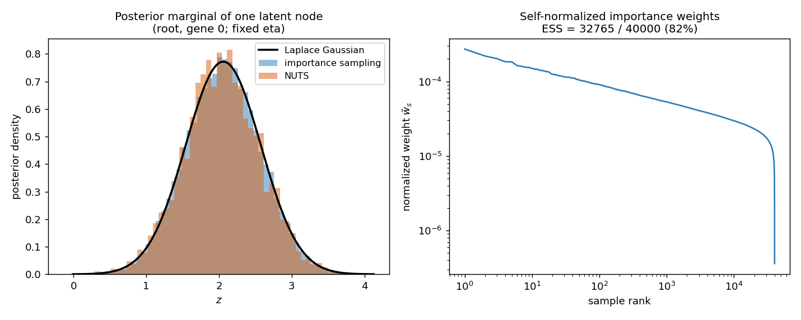

# Inference Engines for the E-step: Laplace, Importance Sampling, and Hamiltonian Monte Carlo

*A textbook-style chapter on approximating the latent posterior of a Gaussian tree model observed through a non-conjugate decoder.*

> **Prerequisites.** This chapter assumes the model, notation, and the Laplace-EM of the main methods write-up ([`docs/methods.md`](methods.md), especially sections 6-8). We reuse its running example throughout: a balanced tree, two genes evolving by a correlated latent Brownian motion, observed as Poisson counts. Here the tree has $n=32$ leaves; we hold the evolutionary parameters $\eta=(\alpha,\theta,K)$ fixed at their true values and study only the inner inference problem.

---

## Table of contents

1. [The E-step, abstractly](#1-the-e-step-abstractly)
2. [The posterior we must summarize](#2-the-posterior-we-must-summarize)
3. [Engine I: the Laplace approximation](#3-engine-i-the-laplace-approximation)
4. [A primitive: exact Gaussian sampling on the tree (FFBS)](#4-a-primitive-exact-gaussian-sampling-on-the-tree-ffbs)
5. [Engine II: importance sampling](#5-engine-ii-importance-sampling)
6. [Engine III: Hamiltonian Monte Carlo (NUTS)](#6-engine-iii-hamiltonian-monte-carlo-nuts)
7. [Head-to-head on the running example](#7-head-to-head-on-the-running-example)
8. [How an engine plugs into EM](#8-how-an-engine-plugs-into-em)
9. [What variational inference would add (deferred)](#9-what-variational-inference-would-add-deferred)
10. [References](#10-references)

---

## 1. The E-step, abstractly

Expectation-Maximization maximizes the marginal log-likelihood $\log p(Y\mid\eta)$ by repeatedly building and maximizing a surrogate. Given a current guess $\eta^{\text{old}}$, the **E-step** forms

$$
\mathcal Q(\eta\mid\eta^{\text{old}}) \;=\; \mathbb E_{Z\sim p(\cdot\mid Y,\eta^{\text{old}})}\!\big[\log p(Y,Z\mid\eta)\big],
\tag{1.1}
$$

and the **M-step** maximizes $\mathcal Q$ over $\eta$. The expectation is taken under the **posterior over the latent trajectory** $p(Z\mid Y,\eta^{\text{old}})$ — and computing (or approximating) that expectation is the entire subject of this chapter.

A crucial simplification (the *Fisher decomposition* for our model) is that the complete-data log-likelihood factorizes over tree edges,

$$
\log p(Y,Z\mid\eta) = \underbrace{\log p(Y\mid Z)}_{\text{no }\eta}
+ \sum_{u}\log\mathcal N\!\big(z_u - \phi_u z_{\mathrm{pa}(u)} - c_u;\ 0,\ v_u K\big),
\tag{1.2}
$$

so each term depends on at most a parent-child *pair* $(z_u, z_{\mathrm{pa}(u)})$. Therefore the M-step does not need the full joint posterior — it needs only the **pairwise posterior moments** along edges. Concretely, every engine must return, for each node $i$ with parent $\mathrm{pa}(i)$:

$$
m_i = \mathbb E[z_i],\qquad
\Sigma_{ii} = \operatorname{Cov}(z_i),\qquad
\Sigma_{i,\mathrm{pa}} = \operatorname{Cov}(z_i, z_{\mathrm{pa}(i)}),
\tag{1.3}
$$

from which the per-edge expected outer product $\mathbb E[\Delta z_u\,\Delta z_u^\top]$ (with $\Delta z_u = z_u - \phi_u z_{\mathrm{pa}(u)} - c_u$) is assembled. This triple $\{m_i,\Sigma_{ii},\Sigma_{i,\mathrm{pa}}\}$ is the **E-step contract**: in code, every engine returns `{"Z": m, "Sigma": Σ, "cross": Σ_pa}` and the M-step is oblivious to which engine produced it.

This chapter develops three ways to produce (1.3):

| Engine | Idea | Bias | Cost | Exact when |
|---|---|---|---|---|
| Laplace | Gaussian fit at the mode | $O(\text{3rd deriv})$ | one $O(np^3)$ factorization | likelihood is Gaussian |
| Importance sampling | reweight Laplace draws | none (consistent) | $S\times$ likelihood evals | $S\to\infty$ |
| HMC / NUTS | gradient-guided MCMC | none (asymptotic) | many gradient evals | $\#\text{samples}\to\infty$ |

---

## 2. The posterior we must summarize

Stack the latent vectors of all $N$ tree nodes into $Z\in\mathbb R^{N\times p}$ and write $F = Z_{\text{leaves}}$ for the leaf block that the decoder sees. The model is a **latent Gaussian model**: a Gaussian prior times a non-Gaussian likelihood,

$$
p(Z\mid\eta) = \mathcal N\!\big(Z;\ m,\ Q^{-1}\big),\qquad
p(Y\mid Z) = \prod_{i\in\mathcal L}\prod_{g} p(Y_{ig}\mid z_{ig}),
$$

where $Q = A\otimes K^{-1}$ is the sparse tree precision (methods §7). The posterior is

$$
p(Z\mid Y,\eta) \;\propto\; \exp\!\Big\{\underbrace{\ell(F)}_{\log p(Y\mid Z)} \;-\; \tfrac12 (Z-m)^\top Q\,(Z-m)\Big\},
\tag{2.1}
$$

with $\ell$ the decoder log-likelihood. Three structural facts drive everything below:

1. **Log-concavity.** For a log-concave decoder (Poisson with log link, Gaussian), $\ell$ is concave, so the log-posterior (2.1) is strictly concave: the posterior is **unimodal**, and Newton's method finds its mode reliably.
2. **Near-Gaussianity.** When the per-leaf likelihood is informative and smooth, the posterior is close to a Gaussian — so a Gaussian *built at the mode* (Laplace) is already a good answer, and an excellent *proposal* for the sampling engines.
3. **Sparsity is preserved.** The posterior precision is $Q + W$ with $W = -\nabla^2\ell$ block-diagonal over leaves, so it has the same tree sparsity as $Q$. Every linear-algebra primitive we need — factorization, solves, log-determinants, covariance blocks, and (below) exact sampling — costs $O(np^3)$.

Our running posterior is (2.1) for the 32-leaf, two-gene Poisson example at the true $\eta$. We will track one scalar summary in particular: the posterior marginal of the **root node, gene 0**, which (being farthest from the data) has the broadest, most interesting posterior.

---

## 3. Engine I: the Laplace approximation

**Idea.** Approximate the posterior (2.1) by the Gaussian that matches its mode and curvature.

**Construction.** Let $\Psi(Z) = -\ell(F) + \tfrac12 (Z-m)^\top Q (Z-m)$ be the negative log-posterior (up to a constant). Its minimizer $\hat Z=\arg\min\Psi$ is the posterior **mode**, found by Newton's method: each step solves

$$
(Q + W)\,\delta = -\nabla\Psi(\hat Z^{(t)}),\qquad
\nabla\Psi = Q(Z-m) - \nabla\ell,\quad W=-\nabla^2\ell,
$$

with the $(Q+W)$ solve done by tree (block) Gaussian elimination in $O(np^3)$ and a backtracking line search for global convergence (methods §6.3, §7.2). A second-order Taylor expansion of $\Psi$ around $\hat Z$,

$$
\Psi(Z) \approx \Psi(\hat Z) + \tfrac12 (Z-\hat Z)^\top H (Z-\hat Z),\qquad H = Q + W\big|_{\hat Z},
$$

yields the Laplace posterior

$$
\boxed{\ q_{\text{Lap}}(Z) = \mathcal N\!\big(Z;\ \hat Z,\ H^{-1}\big),\qquad H = Q + W.\ }
\tag{3.1}
$$

**Reading off the moments (1.3).** The mean is the mode, $m_i = \hat Z_i$. The covariance blocks are blocks of $H^{-1}$, which we obtain **without inverting** $H$ by a Rauch-Tung-Striebel (RTS) smoother that reuses the elimination's Cholesky pivots $d_i$ and gains $G_i = -d_i^{-1} o_i K^{-1}$:

$$
\Sigma_{\text{root}} = d_{\text{root}}^{-1},\qquad
\Sigma_{i,\mathrm{pa}} = G_i\,\Sigma_{\mathrm{pa}},\qquad
\Sigma_{ii} = d_i^{-1} + G_i\,\Sigma_{\mathrm{pa}}\,G_i^\top.
\tag{3.2}
$$

(This is `_MVTreeModel.posterior_covariances`; the engine wrapper is `LaplaceEStep`, delegating to `mv_laplace_estep`.)

**Properties.** Deterministic; a single $O(np^3)$ factorization plus a handful of Newton steps; **exact** when $\ell$ is Gaussian (then $\Psi$ is exactly quadratic). Its error is governed by the third and higher derivatives of $\ell$ at the mode — i.e. by how non-Gaussian (skewed/heavy-tailed) the posterior is. For aggregated counts with moderate-to-large totals, as here, that error is tiny. The same Laplace device underlies INLA (Rue, Martino & Chopin 2009) and Gaussian-process classification (Rasmussen & Williams 2006, Ch. 3); Tierney & Kadane (1986) is the classical reference for Laplace approximation of posterior expectations.

---

## 4. A primitive: exact Gaussian sampling on the tree (FFBS)

Both sampling engines need to draw from a tree-structured Gaussian — for importance sampling, the proposal $q_{\text{Lap}}$ itself. Drawing $N(\hat Z, H^{-1})$ naively would cost $O((np)^3)$; we instead sample in $O(np^3)$ by a **forward-filter / backward-sample** (FFBS) simulation smoother, the sampling analogue of the RTS recursion (3.2).

Factorize $H=Q+W$ by the same leaves-to-root elimination used for the mode. This is equivalent to writing the Gaussian as a directed chain *down* the tree: the conditional of a node given its parent is

$$
z_i \mid z_{\mathrm{pa}(i)} \ \sim\ \mathcal N\!\Big(\hat Z_i + G_i\,(z_{\mathrm{pa}(i)} - \hat Z_{\mathrm{pa}(i)}),\ \ d_i^{-1}\Big),\qquad
G_i = -d_i^{-1}o_i K^{-1},
\tag{4.1}
$$

with the same pivots $d_i$ and gains $G_i$ as (3.2). To draw a sample, work in centred coordinates $\delta = z - \hat Z$: sample the root $\delta_{\text{root}}\sim\mathcal N(0,d_{\text{root}}^{-1})$, then sweep parent-to-child setting $\delta_i = G_i\,\delta_{\mathrm{pa}(i)} + \varepsilon_i$ with $\varepsilon_i\sim\mathcal N(0,d_i^{-1})$, and finally add back $\hat Z$. By construction the draws have covariance **exactly** equal to the smoother blocks (3.2) — a fact we verify numerically in §7. This is `_MVTreeModel.sample_gaussian`; the recursion is the multivariate, tree-structured version of the Carter & Kohn (1994) / Frühwirth-Schnatter (1994) FFBS and the Durbin & Koopman (2002) simulation smoother.

---

## 5. Engine II: importance sampling

**Idea.** Keep the Laplace Gaussian as a *proposal*, but correct it to the true posterior by reweighting. This removes Laplace's approximation bias (as the sample size grows) and, as a bonus, estimates the marginal likelihood.

**General self-normalized importance sampling.** For a target $p(Z\mid Y)=\tilde p(Z)/\mathcal Z$ known only up to its normalizer $\mathcal Z=p(Y)$, and a proposal $q$, any posterior expectation can be written as a ratio of $q$-expectations,

$$
\mathbb E_{p}[h(Z)] = \frac{\mathbb E_q[\,w(Z)\,h(Z)\,]}{\mathbb E_q[\,w(Z)\,]},\qquad
w(Z) = \frac{\tilde p(Z)}{q(Z)} .
$$

Drawing $Z_1,\dots,Z_S\sim q$ and forming **self-normalized weights** $\tilde w_s = w(Z_s)/\sum_{s'} w(Z_{s'})$ gives the consistent estimator $\widehat{\mathbb E_p[h]} = \sum_s \tilde w_s\,h(Z_s)$.

**Specialization here.** The proposal is $q = q_{\text{Lap}} = \mathcal N(\hat Z, H^{-1})$ from (3.1), sampled by FFBS (§4). The unnormalized target is $\tilde p(Z) = \exp\{\ell(F) - \tfrac12(Z-m)^\top Q(Z-m)\}$ from (2.1). Taking logs, the log-weight of a draw is (dropping the $(2\pi)^{Np/2}$ terms, which are identical for $p$ and $q$ and cancel):

$$
\log w_s = \underbrace{\ell(F_s)}_{\text{decoder}} \;-\; \tfrac12\,(Z_s-m)^\top Q\,(Z_s-m) \;+\; \tfrac12\,(Z_s-\hat Z)^\top (Q+W)\,(Z_s-\hat Z) \;+\; \text{const},
\tag{5.1}
$$

where the first two terms are the log-target and the third is $-\log q$ (minus its normalizer). Each quadratic is an $O(np^2)$ edge recursion. The implementation is a direct transcription of (5.1):

```120:132:src/scphytr/inference/estep.py
        delta = Zs - mode[None]
        prior_q = _prior_quad_batch(M, Zs, centered=False)
        prop_q = (_prior_quad_batch(M, delta, centered=True)
                  + np.einsum("snp,np->s", delta ** 2, Wdiag))
        loglik = np.array([obs.loglik(Zs[s, leaf]) for s in range(self.n_samples)])
        logw = loglik - 0.5 * prior_q + 0.5 * prop_q

        # Absolute marginal: add the constant 0.5(log|Q| - log|Q+W|); the (2π)
        # factors cancel between prior and proposal.
        log_const = 0.5 * (M.log_det_Q - M.log_det(Wdiag))
        logZ = float(logsumexp(logw) - np.log(self.n_samples) + log_const)

        wn = np.exp(logw - logsumexp(logw))
```

**Posterior moments.** With normalized weights $\tilde w_s$, the contract (1.3) is the set of weighted sample moments,

$$
m_i = \sum_s \tilde w_s\, Z_{s,i},\quad
\Sigma_{ii} = \sum_s \tilde w_s\,(Z_{s,i}-m_i)(Z_{s,i}-m_i)^\top,\quad
\Sigma_{i,\mathrm{pa}} = \sum_s \tilde w_s\,(Z_{s,i}-m_i)(Z_{s,\mathrm{pa}}-m_{\mathrm{pa}})^\top.
$$

**The marginal likelihood, for free.** Reinstating the constants $\tfrac12(\log|Q| - \log|Q+W|)$ that cancelled above, the *non-self-normalized* weights give an (essentially unbiased) estimator of the marginal,

$$
\widehat{\log p(Y\mid\eta)} = \operatorname{logsumexp}_s(\log w_s^{\text{full}}) - \log S,
\tag{5.2}
$$

which is a direct, independent check on the Laplace marginal of methods §7.

**Diagnostic: effective sample size.** The reliability of IS is summarized by the effective sample size

$$
\text{ESS} = \frac{1}{\sum_s \tilde w_s^2} \in [1, S].
\tag{5.3}
$$

(Kong 1992; Kong, Liu & Wong 1994.) ESS near $S$ means the weights are nearly uniform — the proposal closely matches the posterior. Because our posterior is near-Gaussian and $q_{\text{Lap}}$ is *built* to match it, ESS is high here (§7), and IS behaves like a mild correction to Laplace. The flip side, true of IS in general, is that ESS degrades if the proposal is too narrow or the dimension/non-Gaussianity grows; that is precisely the regime where the next engine takes over. Classical references: Kahn & Marshall (1953), Geweke (1989), Robert & Casella (2004), Owen (2013).

---

## 6. Engine III: Hamiltonian Monte Carlo (NUTS)

**Idea.** When no fixed proposal is trustworthy, draw from the posterior directly with a Markov chain whose stationary distribution *is* the posterior — and use gradients to make the chain efficient in high dimensions.

**Target.** We sample $\pi(Z) \propto \exp\{\ell(F) - \tfrac12 (Z-m)^\top Q (Z-m)\}$, i.e. the posterior (2.1). Its gradient,

$$
\nabla_Z \log\pi(Z) = \nabla\ell(F)\big|_{\text{scattered to leaves}} - Q\,(Z-m),
\tag{6.1}
$$

costs $O(np^2)$ because $Q$ is sparse (one term per edge). In `scPhyTr` the log-density is written in JAX and the gradient (6.1) is obtained by automatic differentiation, so any decoder exposing a differentiable `loglik_jax` is supported:

```167:172:src/scphytr/inference/estep.py
        def logdensity(z_flat):
            Z = z_flat.reshape(N, p)
            d = Z - phi_j[:, None] * Z[par_j] - cmean_j
            quad = jnp.einsum("ip,pq,iq->i", d, P_j, d)
            prior = -0.5 * jnp.sum(invV_j * quad)
            return prior + obs.loglik_jax(Z[leaf_j])
```

**Hamiltonian Monte Carlo.** HMC (Duane et al. 1987; Neal 2011) augments the latent with an auxiliary **momentum** $r\sim\mathcal N(0,M)$ and simulates the physics of a particle with potential energy $U(Z)=-\log\pi(Z)$ and kinetic energy $\tfrac12 r^\top M^{-1} r$. The total energy (Hamiltonian)

$$
\mathcal H(Z,r) = U(Z) + \tfrac12 r^\top M^{-1} r
$$

is conserved by the exact dynamics; numerically it is integrated by the **leapfrog** scheme, which alternates half-steps of momentum (using the gradient (6.1)) and full steps of position. A Metropolis correction accounts for the integrator's discretization error. Because the proposal follows the geometry of the target rather than diffusing randomly, HMC moves long distances with high acceptance even in high dimension — exactly our situation ($Np$ correlated latent coordinates).

**NUTS and warmup.** Plain HMC requires hand-tuning the step size and the number of leapfrog steps. The **No-U-Turn Sampler** (Hoffman & Gelman 2014) removes the trajectory-length tuning by doubling the trajectory until it begins to double back on itself, and sets the step size automatically by dual averaging during a warmup phase. We use the `blackjax` implementation (`window_adaptation` + `nuts`), which additionally adapts a diagonal mass matrix $M$ during warmup; the engine is `MCMCEStep`.

**Posterior moments and diagnostics.** After warmup, the chain's samples are (correlated) draws from $\pi$; the contract (1.3) is computed as ordinary sample means and covariances. Mixing is summarized by the (autocorrelation-corrected) effective sample size and, with multiple chains, the potential scale reduction factor $\hat R$; we also report the mean acceptance probability. HMC carries no Gaussian-approximation bias — it is asymptotically exact — at the price of many gradient evaluations, making it the slowest engine and the natural gold standard, especially for decoders where the posterior is far from Gaussian. See Betancourt (2017) for a conceptual treatment and Lao et al. (2020) / blackjax for the implementation.

---

## 7. Head-to-head on the running example

Holding $\eta$ at the truth, we run all three engines on the same posterior. First, two correctness checks on the building blocks:

- **FFBS sampler vs analytic smoother.** Drawing 20,000 samples with `sample_gaussian` and comparing the empirical covariance to the RTS blocks (3.2): $\max_{\text{nodes}}\|\Sigma_{\text{analytic}}-\Sigma_{\text{sampled}}\| = 0.017$ (pure Monte-Carlo error). The exact sampler is correct.
- **IS marginal vs Laplace marginal.** The Laplace marginal is $\log p(Y\mid\eta) = -312948.79$; the importance-sampling estimator (5.2) gives the same value to within $\Delta=+0.04$. The two independent computations of the marginal agree, validating both.

Next, the posterior itself. The figure below shows the marginal of the root node's gene-0 latent under all three engines, plus the importance-weight distribution.



The three posterior approximations are visually indistinguishable, and their summaries agree to two decimals:

| Engine | posterior mean | posterior sd | diagnostic |
|---|---|---|---|
| Laplace | 2.058 | 0.517 | exact moments of $q_{\text{Lap}}$ |
| Importance sampling | 2.055 | 0.516 | ESS = 32{,}765 / 40{,}000 (82%) |
| NUTS | 2.041 | 0.521 | acceptance = 0.87 |

The right panel of the figure shows why IS is so cheap *here*: the self-normalized weights are nearly flat (ESS $\approx 82\%$), because the Laplace Gaussian is an excellent match to this near-Gaussian posterior. In other words, for log-concave count decoders the three engines essentially **agree**, and the cheapest one (Laplace) is the right default. The value of IS and HMC is (i) as *certificates* that the Laplace approximation is trustworthy on a given dataset, and (ii) as *fallbacks* for future decoders whose posteriors are skewed or multimodal enough that the Gaussian approximation breaks.

Finally, the engines are interchangeable end-to-end: running the full EM (each engine driving the *same* M-step) recovers the same fit,

| Engine | recovered corr (true $+0.80$) | marginal $\log L$ | EM iters |
|---|---|---|---|
| Laplace | $+0.652$ | $-312946.4$ | 13 |
| Importance sampling | $+0.652$ | $-312946.4$ | 13 |
| NUTS | $+0.650$ | $-312946.4$ | 11 |

(The recovered correlation is $0.65$ rather than the $0.72$ of the 64-leaf example in the main text simply because this chapter uses a smaller 32-leaf tree; what matters is that all three engines coincide.) These numbers are produced by `scripts/compare_estep_engines.py`; the figure by `docs/figures/make_engine_figures.py`.

---

## 8. How an engine plugs into EM

The engine is the **only** moving part of the E-step; the M-step (the JAX-gradient maximization of $\mathcal Q$, methods §8.3) is untouched. Each engine returns the identical contract and EM calls it through one line:

```python
es = engine.run(tree, obs, alpha, theta, K, regimes=..., root_value=...)
M, Z, Sigma, cross = es["M"], es["Z"], es["Sigma"], es["cross"]
```

so `fit_mv_em(tree, obs, ..., estep="laplace" | "is" | "mcmc")` selects the engine without any other change.

**One caveat worth stating precisely.** With a deterministic E-step (Laplace) EM is monotone: the marginal never decreases. With a *stochastic* E-step (IS or HMC) the algorithm becomes a **Monte Carlo EM** (Wei & Tanner 1990): the $\mathcal Q$-surrogate is estimated with noise, so the monitored marginal will fluctuate rather than increase monotonically, and exact convergence requires the sample size to grow across iterations (or an ascent-based stopping rule; Caffo, Jank & Jones 2005). In practice we keep the Laplace marginal as the convergence monitor and use the sampling engines either with a generous fixed sample budget or for a final bias-corrected E-step. This is why the default remains Laplace and the sampling engines are opt-in.

---

## 9. What variational inference would add (deferred)

A fourth engine, variational inference (VI), is a natural addition and is currently deferred. Where Laplace fixes the approximating Gaussian's covariance to the *curvature at the mode* $H^{-1}$, VI would **optimize** an approximating family $q_\xi$ to minimize $\mathrm{KL}(q_\xi\,\|\,p(\cdot\mid Y))$, equivalently maximizing the evidence lower bound

$$
\mathrm{ELBO}(\xi) = \mathbb E_{q_\xi}\!\big[\ell(F) - \tfrac12(Z-m)^\top Q(Z-m)\big] + \mathbb H[q_\xi].
$$

The principled choice here is a **structured Gaussian** $q_\xi = \mathcal N(\mu_\xi,\,(Q + D_\xi)^{-1})$ that shares the tree precision and learns only a per-leaf curvature correction $D_\xi$ — mirroring Laplace's $Q+W$ but fitting $D_\xi$ by optimization rather than reading it off the Hessian, and keeping the $O(np^3)$ structure. Reparameterized-gradient ELBO maximization (Kingma & Welling 2014; Rezende et al. 2014) fits naturally with the JAX machinery already used in the M-step, and the FFBS sampler of §4 supplies the required draws from $q_\xi$. This is the route taken by amortized tree-VAEs (methods §10); within `scPhyTr` it would be one more `EStepEngine` returning the same contract (1.3).

---

## 10. References

**Expectation-Maximization and Monte Carlo EM.**
- Dempster, A. P., Laird, N. M. & Rubin, D. B. (1977). *Maximum likelihood from incomplete data via the EM algorithm.* JRSS-B 39:1-38.
- Wei, G. C. G. & Tanner, M. A. (1990). *A Monte Carlo implementation of the EM algorithm.* JASA 85:699-704.
- Caffo, B. S., Jank, W. & Jones, G. L. (2005). *Ascent-based Monte Carlo EM.* JRSS-B 67:235-251.

**Laplace approximation / latent Gaussian models.**
- Tierney, L. & Kadane, J. B. (1986). *Accurate approximations for posterior moments and marginal densities.* JASA 81:82-86.
- Rasmussen, C. E. & Williams, C. K. I. (2006). *Gaussian Processes for Machine Learning*, Ch. 3. MIT Press.
- Rue, H., Martino, S. & Chopin, N. (2009). *Approximate Bayesian inference for latent Gaussian models using INLA.* JRSS-B 71:319-392.

**Gaussian simulation smoothing (FFBS).**
- Carter, C. K. & Kohn, R. (1994). *On Gibbs sampling for state space models.* Biometrika 81:541-553.
- Frühwirth-Schnatter, S. (1994). *Data augmentation and dynamic linear models.* J. Time Series Analysis 15:183-202.
- Durbin, J. & Koopman, S. J. (2002). *A simple and efficient simulation smoother for state space time series analysis.* Biometrika 89:603-616.

**Importance sampling.**
- Kahn, H. & Marshall, A. W. (1953). *Methods of reducing sample size in Monte Carlo computations.* Operations Research 1:263-278.
- Geweke, J. (1989). *Bayesian inference in econometric models using Monte Carlo integration.* Econometrica 57:1317-1339.
- Kong, A. (1992). *A note on importance sampling using standardized weights.* Tech. Report 348, Univ. of Chicago. (Effective sample size.)
- Kong, A., Liu, J. S. & Wong, W. H. (1994). *Sequential imputations and Bayesian missing data problems.* JASA 89:278-288.
- Robert, C. P. & Casella, G. (2004). *Monte Carlo Statistical Methods*, 2nd ed. Springer.
- Owen, A. B. (2013). *Monte Carlo Theory, Methods and Examples.*

**Hamiltonian Monte Carlo / NUTS.**
- Duane, S., Kennedy, A. D., Pendleton, B. J. & Roweth, D. (1987). *Hybrid Monte Carlo.* Physics Letters B 195:216-222.
- Neal, R. M. (2011). *MCMC using Hamiltonian dynamics.* In *Handbook of Markov Chain Monte Carlo*, Ch. 5.
- Hoffman, M. D. & Gelman, A. (2014). *The No-U-Turn Sampler.* JMLR 15:1593-1623.
- Betancourt, M. (2017). *A conceptual introduction to Hamiltonian Monte Carlo.* arXiv:1701.02434.
- Lao, J. et al. (2020). *tfp.mcmc / blackjax: modular MCMC in JAX.* (blackjax: Cabezas, Lao & Louf.)

**Variational inference (for the deferred engine).**
- Kingma, D. P. & Welling, M. (2014). *Auto-encoding variational Bayes.* ICLR.
- Rezende, D. J., Mohamed, S. & Wierstra, D. (2014). *Stochastic backpropagation and approximate inference in deep generative models.* ICML.
